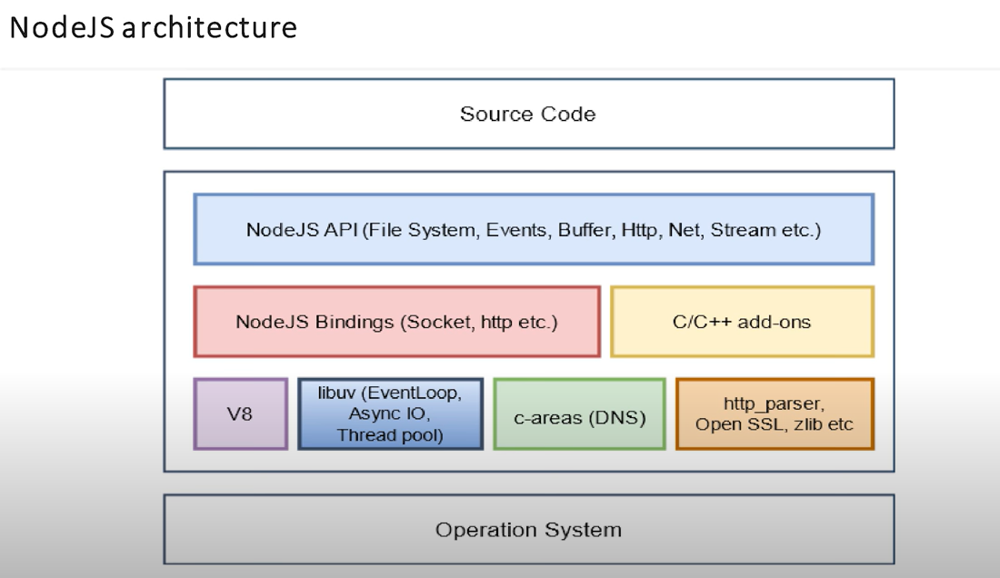
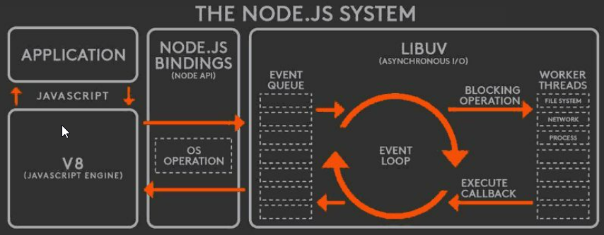
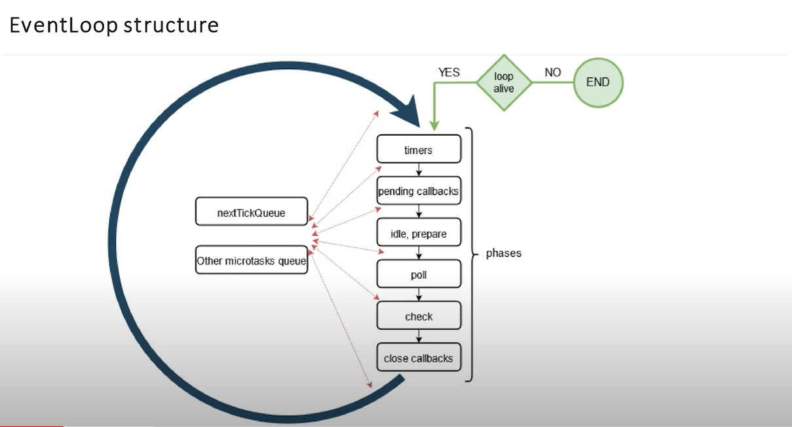
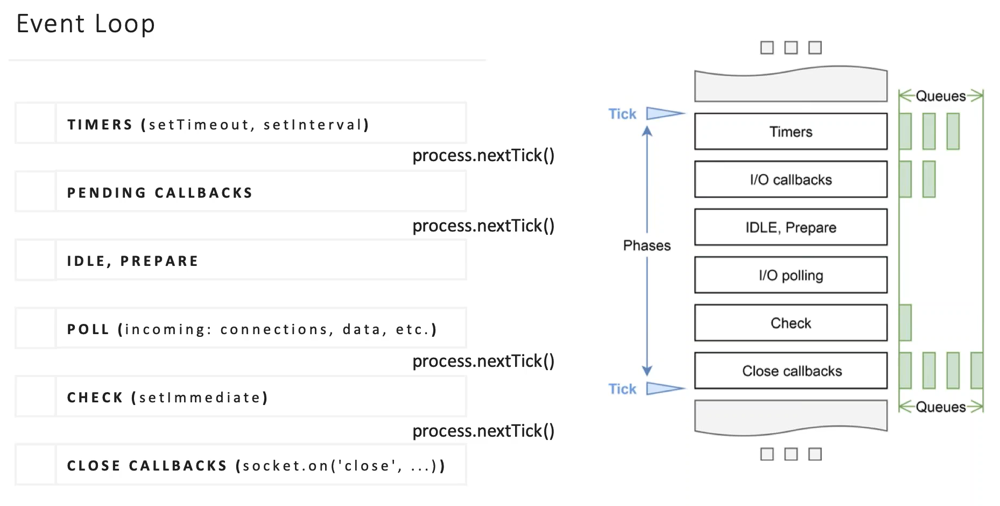
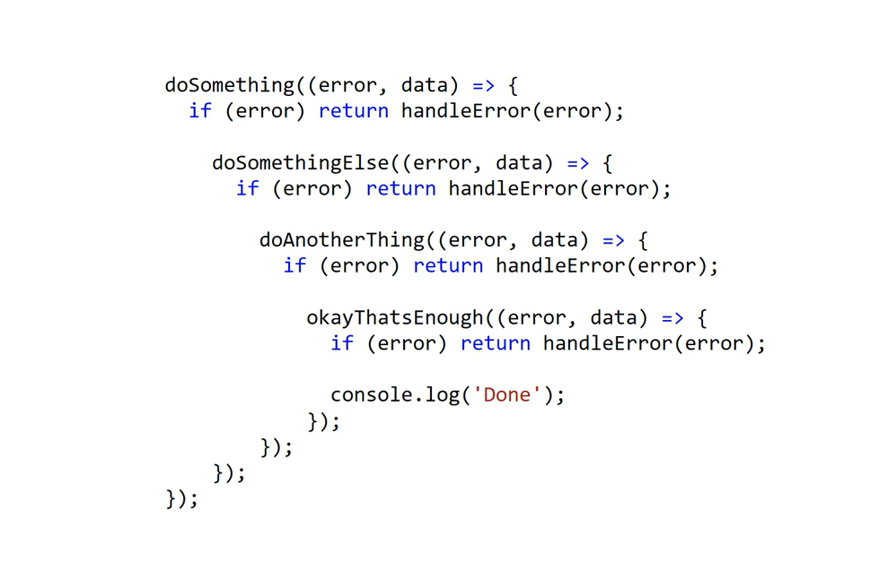
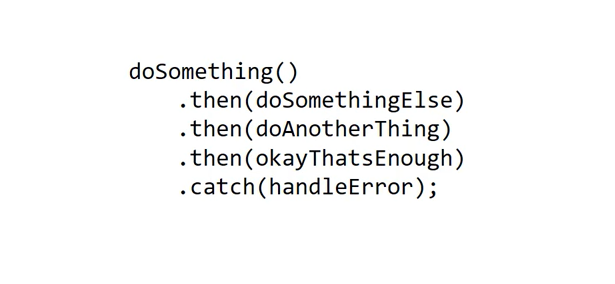

# Table of Contents by topics

| Index | No.      | Questions                                                                                                                                                              | Priority |
|-------|----------|------------------------------------------------------------------------------------------------------------------------------------------------------------------------|----------|
|       | **1**    | **Node.js**                                                                                                                                                            |          |
| 1     | 1.1      | [What is Node.js?](#11-what-is-nodejs)                                                                                                                                 | High     |
| 2     | 1.2      | [When to use Node.js and when not to use it?](#12-when-to-use-nodejs-and-when-not-to-use-it)                                                                           | Medium   |
| 3     | 1.3      | [What is package.json?](#13-what-is-packagejson)                                                                                                                       | High     |
| 4     | 1.4      | [What is the difference between dependencies and devDependencies in package.json?](#14-what-is-the-difference-between-dependencies-and-devdependencies-in-packagejson) | Low      |
| 5     | 1.5      | [What is npm?](#15-what-is-npm)                                                                                                                                        | Medium   |
| 6     | 1.6      | [What is the difference between Sync vs Async operations?](#16-what-is-the-difference-between-sync-vs-async-operations)                                                | Medium   |
| 7     | 1.7      | [How Event Loop works?](#17-how-event-loop-works)                                                                                                                      | High     |
| 8     | 1.8      | [Is Node.js entirely based on a single-thread?](#18-is-nodejs-entirely-based-on-a-single-thread)                                                                       | High     |
| 9     | 1.9      | [What is the Event Emitter class? How it is related to other classes?](#19-what-is-the-event-emitter-class-how-it-is-related-to-other-classes)                         | Low      |
| 10    | 1.10     | [What kinds of streams does Node.js have?](#110-what-kinds-of-streams-does-nodejs-have)                                                                                | High     |
| 11    | 1.11     | [When Streams can be used in Node.js?](#111-when-streams-can-be-used-in-nodejs)                                                                                        | Medium   |
| 12    | 1.12     | [What are the differences between worker thread and child_process?](#112-what-are-the-differences-between-worker-thread-and-child-process)                             | Low      |
| 13    | 1.13     | [What is the difference between commonJS and ES modules?](#113-what-is-the-difference-between-commonjs-and-es-modules)                                                 | Low      |
| 14    | 1.14     | [How to force node.js to treat your  .js files as ES modules?](#114-how-to-force-nodejs-to-treat-your-js-files-as-es-modules)                                          | Low      |
| 15    | 1.15     | [What is a Memory Leak? How to prevent it?](#115-what-is-a-memory-leak-how-to-prevent-it)                                                                              | Medium   |

## 2 Dealing with async code

| Index | No.   | Questions                                                                                                                                                                                      | Priority |
|-------|-------|------------------------------------------------------------------------------------------------------------------------------------------------------------------------------------------------|----------|
|       | **2** | **Dealing with async code**                                                                                                                                                                    |          |
| 16    | 2.1   | [How do you understand the Callback Pattern? What is a callback hell?](#21-how-do-you-understand-the-callback-pattern-what-is-a-callback-hell)                                                 | High     |
| 17    | 2.2   | [What is a Promise?](#22-what-is-a-promise)                                                                                                                                                    | High     |
| 18    | 2.3   | [What states do the Promise have? Can the state be changed once it was fulfilled or rejected?](#23-what-states-do-the-promise-have-can-the-state-be-changed-once-it-was-fulfilled-or-rejected) | High     |
| 19    | 2.4   | [What are the advantages of the async/await over Promises?](#24-what-are-the-advantages-of-the-asyncawait-over-promises)                                                                       | Medium   |
| 20    | 2.5   | [What is Promisification and when it is used?](#25-what-is-promisification-and-when-it-is-used)                                                                                                | Low      |

## 3 Express.js

| Index | No.   | Questions                                                                      | Priority |
|-------|-------|--------------------------------------------------------------------------------|----------|
|       | **3** | **Express.js**                                                                 |          |
| 21    | 3.1   | What is Express.js and what is its use?                                        | Medium   |
| 22    | 3.2   | What are the main building blocks of Express.js?                               | Medium   |
| 23    | 3.3   | What are the purposes for middlewares in Express.js?                           | High     |
| 24    | 3.4   | What is the use of **next** in Express.js?                                     | Medium   |
| 25    | 3.5   | How can you differ an error handling function from a request handler function? | Low      | 

## 4 NestJS

| Index | No.   | Questions                                                                           | Priority |
|-------|-------|-------------------------------------------------------------------------------------|----------|
|       | **4** | **NestJS**                                                                          |          |
| 26    | 4.1   | What can be a Provider in NestJS?                                                   | Low      |
| 27    | 4.2   | What are the use cases for Pipes in NestJS?                                         | Low      |
| 28    | 4.3   | Is there a possibility to bind extra logic before/after method execution in NestJS? | Low      |
| 29    | 4.4   | How all unhandled exceptions are processed in NestJS?                               | Low      |

## 5 Monitoring and Logging

| Index | No.   | Questions                                                         | Priority |
|-------|-------|-------------------------------------------------------------------|----------|
|       | **5** | **Monitoring and Logging**                                        | Low      |
| 30    | 5.1   | What is a Health check? Why do we need it?                        | Low      |
| 31    | 5.2   | What is a correlation ID? How it helps to debug your application? | Low      |

## 6 Testing

| Index | No.   | Questions                                                             | Priority |
|-------|-------|-----------------------------------------------------------------------|----------|
|       | **6** | **Testing**                                                           |          |
| 32    | 6.1   | What is a test pyramid? How can you implement it regarding HTTP APIs? | High     |
| 33    | 6.2   | What is a Given-When-Then pattern?                                    | Medium   |
| 34    | 6.3   | What mocks and stubs are? How are they used in integration testing?   | Medium   |
| 35    | 6.4   | What test runner libraries do you know?                               | Low      |
| 36    | 6.5   | What is Unit-testing? What are the FIRST principles?                  | High     |

## 7 Software design

| Index | No.   | Questions                                                                           | Priority |
|-------|-------|-------------------------------------------------------------------------------------|----------|
|       | **7** | **Software design**                                                                 |          |
| 37    | 7.1   | REST API: What is it?                                                               | High     |
| 38    | 7.1.1 | REST API: What are the Levels of REST API?                                          | Low      |
| 39    | 7.1.2 | REST API: What constraints does the REST have?                                      | Medium   |
| 40    | 7.1.3 | REST API: Name the main Http methods. What is the difference between Put and Patch? | High     |
| 41    | 7.1.4 | REST API: What status should be sent in a response to a create object request?      | Medium   |
| 42    | 7.2   | explain the MVC model.                                                              | High     |
| 43    | 7.3   | What is GraphQL? What are its advantages over REST API?                             | Low      |
| 44    | 7.4   | Name the key principles of OOP?                                                     | High     |
| 45    | 7.5   | What is a dependency injection?                                                     | Medium   |
| 46    | 7.6   | What is a Layered Architecture? Give a few examples                                 | Medium   |

## 8 Databases

| Index | No.      | Questions                                                        | Priority |
|-------|----------|------------------------------------------------------------------|----------|
|       | **8**    | **Databases**                                                    |          |
|       | 8.1      | **_RDBMS_ (Postgres or MySQL)**                                  |          |
| 47    | 8.1.0    | RDBMS: What is it?                                               | High     |
| 48    | 8.1.1    | How data is stored in RDBMS?                                     | High     |
| 49    | 8.1.2    | What is a normalization concept?                                 | Medium   |
| 50    | 8.1.3    | What table relationships do you know? How to create them?        | Medium   |
| 51    | 8.1.4    | What is the difference between DDL and DML?                      | Medium   |
| 52    | 8.1.5    | What data types are presented in PostgresSQL?                    | Low      |
| 53    | 8.1.6    | How tables can be joined?                                        | High     |
| 54    | 8.1.7    | What is a sub query?                                             | Low      |
| 55    | 8.1.8    | Explain Transactions and ACID.                                   | High     |
| 56    | 8.1.9    | What are Lock Levels in Postgres?                                | Low      |
| 57    | 8.1.10   | What type of indexes do you know? When to use them?              | High     |
| 58    | 8.1.11   | What is ORM? What problems does it solve?                        | Low      |
|       | 8.1.12   | **TypeORM**                                                      |          |
| 59    | 8.1.12.1 | - What is the Query Builder?                                     | Low      |
| 60    | 8.1.12.2 | - What are Active Record and Data Mapper patterns?               | Low      |
| 61    | 8.1.12.3 | - What is the difference between Raw Entities and Entities?      | Low      |
| 62    | 8.1.12.4 | - How to process tables with a lot of data inside with typeorm?  | Low      |
| 63    | 8.1.12.5 | - How to change an already defined table structure with typeorm? | High     |
|       | 8.2      | **_NoSQL DB_**                                                   |          |
| 64    | 8.2.1    | What is MongoDB?                                                 | High     |
| 65    | 8.2.2    | How data is organized in MongoDB?                                | Medium   |
| 66    | 8.2.3    | What does the BASE stand for?                                    | Medium   |
| 67    | 8.2.4    | How to make a relationship between Documents in MongoDB?         | Medium   |
| 68    | 8.2.5    | How scaling of NoSQL and SQL databases differs?                  | High     |

## 9 Security

| Index | No.   | Questions                                                          | Priority |
|-------|-------|--------------------------------------------------------------------|----------|
|       | **9** | **Security**                                                       |          |
| 69    | 9.1   | What is the difference among Encoding, Encryption and Hashing?     | Medium   |
| 70    | 9.2   | What are the use cases for Encoding, Encryption and Hashing?       | Medium   |
| 71    | 9.3   | How do you understand symmetric and asymmetric encryption?         | Low      |
| 72    | 9.4   | What is the difference between private and public key?             | Low      |
| 73    | 9.5   | What is HTTPS? How it works?                                       | Medium   |
| 74    | 9.6   | What is Authentication and Authorization?                          | Medium   |
| 75    | 9.7   | What is JWT? Is it safe to store sensitive information inside JWT? | High     |
| 76    | 9.8   | What types of Authentication do you know? When to use them?        | Low      |

## 10 General questions

| Index | No.    | Questions                                                                       | Priority |
|-------|--------|---------------------------------------------------------------------------------|----------|
|       | **10** | **General questions**                                                           |          |
| 77    | 13.1   | Name the main advantages of Microservice architecture over Monolith             | Medium   |
| 78    | 13.2   | How do you understand an event-driven architectures? What is a pub-sub pattern? | Medium   |
| 79    | 13.3   | What is a 3-tier WEB Application? Are the tiers logical or physical?            | Low      |

---
## 1 Answers Node.js

### 1.1 What is NodeJS?

**NodeJS** is an open-source, cross-platform, JavaScript runtime environment that executes JavaScript code outside a browser. Node JS was created by Ryan Dahl, Ryan Dahl is a software engineer and the original developer of the Node.js JavaScript runtime.

> **References:**
>
> - [NodeJS.org](https://nodejs.org/en/about/)
 
 **[ Back to Top ⬆ ](#table-of-contents-by-topics)**

---

### 1.2 When to use NodeJs and when not to use it?

**What is Node.js used for?**
* Real-time applications
* IoT applications.
* Collaborative tools
* Data streaming applications
* Applications relying on scalability

**When is Node.js not a good idea?**
* Applications with heavy computing server-side.
* CRUD applications.
* Server-side web applications with relational databases.

> **References:**
>
> - [Why and When to Use Node.js](https://relevant.software/blog/why-and-when-to-use-node-js/)

**[ Back to Top ⬆ ](#table-of-contents-by-topics)**

---

### 1.3 What is package.json?
The package.json file in Node.js is the heart of the entire application. It is basically the manifest file that contains the metadata of the project where we define the properties of a package.
> **References:**
>
> - [The Basics of Package.json](https://nodesource.com/blog/the-basics-of-package-json)

**[ Back to Top ⬆ ](#table-of-contents-by-topics)**

---

### 1.4 What is the difference between dependencies and devDependencies in package.json?
`dependencies` are the modules that project requires to function effectively on production.    
`devDependencies` are the modules that is needed by the developer during development.  

also we have:  
`peerDependencies` are the modules that is needed when you creating npm packages.    

> **References:**
>
> - [dependencies && devDependencies && peerDependencies](https://www.geeksforgeeks.org/difference-between-dependencies-devdependencies-and-peerdependencies/)
> - [dependencies && devDependencies && peerDependencies youtube](https://www.youtube.com/watch?v=SwBbPQWNP9k)
> - [dependencies youtube](https://www.youtube.com/watch?v=Sl5cK0if0xY)
> - [devDependencies youtube](https://www.youtube.com/watch?v=_urfyYFfyjU)
> - [peerDependencies youtube](https://www.youtube.com/watch?v=0l9YLCk0wOo)

**[ Back to Top ⬆ ](#table-of-contents-by-topics)**

---

### 1.5 What is npm?
npm (Node Package Manager) is the default package manager for Node.js. It makes it possible to install packages, manage dependencies and versions of the packages we use

NPM is a package manager for Node.js packages, or modules if you like.
www.npmjs.com hosts thousands of free packages to download and use.
The NPM program is installed on your computer when you install Node.js
> **References:**
>
> - [What is NPM?](https://www.w3schools.com/nodejs/nodejs_npm.asp#:~:text=What%20is%20NPM%3F,to%20run%20on%20your%20computer!)
> - [Node.js | NPM (Node Package Manager)](https://www.geeksforgeeks.org/node-js-npm-node-package-manager/)

**[ Back to Top ⬆ ](#table-of-contents-by-topics)**

---

### 1.6 What is the difference between Sync vs Async operations?
**Synchronous** code is also called “blocking” as it halts the program until all the resources are available.

Synchronous execution usually uses to code executing in sequence and the program is executed line by line, one line at a time. When a function is called, the program execution waits until that function returns before continuing to the next line of code.

**Asynchronous** code is also known as “non-blocking”. The program continues executing and doesn't wait for external resources (I/O) to be available.

Asynchronous execution applies to execution that doesn't run in the sequence it appears in the code. The program doesn't wait for the task to complete and can move on to the next task.

> **References:**
>
> - [What is Synchronous vs. Asynchronous in Node.js](https://medium.com/linkit-intecs/what-is-synchronous-vs-asynchronous-in-node-js-4b45ee668e6f)
> - [Difference between synchronous and asynchronous method of fs module](https://www.geeksforgeeks.org/difference-between-synchronous-and-asynchronous-method-of-fs-module/)

**[ Back to Top ⬆ ](#table-of-contents-by-topics)**

---

### 1.7 How Event Loop works?





Phases Overview:  
`Phases: nextTickQueue mickrotasks Queue`  
**timers**: this phase executes callbacks scheduled by setTimeout() and setInterval().  
`Phases: nextTickQueue mickrotasks Queue`  
**pending callbacks**: executes I/O callbacks deferred to the next loop iteration.  
`Phases: nextTickQueue mickrotasks Queue`  
**idle, prepare**: only used internally.  
`Phases: nextTickQueue mickrotasks Queue`  
**poll**: retrieve new I/O events; execute I/O related callbacks (almost all with the exception of close callbacks, the ones scheduled by timers, and setImmediate()); node will block here when appropriate.  
`Phases: nextTickQueue mickrotasks Queue`  
**check**: setImmediate() callbacks are invoked here.  
`Phases: nextTickQueue mickrotasks Queue`  
**close callbacks**: some close callbacks, e.g. socket.on('close', ...).
`Phases: nextTickQueue mickrotasks Queue`

Between each of these phases there is a phase with next and nextTickQueue microtasks Queue

> **References:**
>
> - [What is the Event Loop?](https://nodejs.org/en/docs/guides/event-loop-timers-and-nexttick/#:~:text=Event%20Loop%20Explained,begins%20processing%20the%20event%20loop.)
> - [Event loop в Node.js youtube](https://www.youtube.com/watch?v=7f787SsgknA)
> - [Node.js #1: Что такое событийный цикл? (Events loop) youtube](https://www.youtube.com/watch?v=n6I0OQY6CFU)

**[ Back to Top ⬆ ](#table-of-contents-by-topics)**

---

### 1.8 Is Node.js entirely based on a single-thread?
NodeJS uses "Single Threaded Event Loop Model" architecture to handle multiple operations. However, libuv works multi-thread behind the scene.

> **References:**
>
> - [What exactly is Node.js?](https://www.freecodecamp.org/news/what-exactly-is-node-js-ae36e97449f5/)
> - [Is Node.js Single-Threaded or Multi-Threaded? and Why?](https://dev.to/arealesramirez/is-node-js-single-threaded-or-multi-threaded-and-why-ab1)
> - [Многопоточность в Node.js](https://tproger.ru/translations/guide-to-threads-in-node-js/)

**[ Back to Top ⬆ ](#table-of-contents-by-topics)**

---

### 1.9 What is the Event Emitter class? How it is related to other classes?

Events module in Node.js allows us to create and handle custom events. The Event module contains “EventEmitter” class which can be used to raise and handle custom events. It is accessible via the following code.

``` JavaScript
// Import events module
var events = require('events');

// Create an eventEmitter object
var eventEmitter = new events.EventEmitter();
```

When an EventEmitter instance encounters an error, it emits an “error” event. When a new listener gets added, it fires a “newListener” event and when a listener gets removed, it fires a “removeListener” event.
EventEmitter provides multiple properties like “on” and “emit”. The “on” property is used to bind a function to the event and “emit” is used to fire an event.

or

Event Emitters
EventEmitter is a class that helps us create a publisher-subscriber pattern in NodeJS.

With an event emitter, we can simply raise a new event from a different part of an application, and a listener will listen to the raised event and have some action performed for the event.

> **References:**
>
> - [Node Event Emitters — For Beginners and Experts](https://medium.com/developers-arena/nodejs-event-emitters-for-beginners-and-for-experts-591e3368fdd2)
> - [Events](https://nodejs.org/docs/latest/api/events.html)

**[ Back to Top ⬆ ](#table-of-contents-by-topics)**

---

### 1.10 What kinds of streams does Node.js have?
Streams are objects that allow the reading of data from the source and writing of data to the destination as a continuous process.  

There are four types of streams:
**Writable** streams are the streams that data can be written on.  
**Readable** streams are the streams that data can be read from.  
**Duplex** streams are both readable and writeable streams.  
**Transform** streams are Duplex streams that can modify the data while being written and read.

Advantages of Streams over other data handling methods:

**Time Efficient:** We don’t have to wait until entire file has been transmitted. We can start processing data as soon as we have it.  
**Memory Efficient:** We don’t have to load huge amount of data in memory before we start processing.

> **References:**
>
> - [Types of streams (https://nodejs.org/)](https://nodejs.org/api/stream.html#types-of-streams)
> - [How to use streams in Node.js]( https://fauna.com/blog/how-to-use-node-js-streams)
> - [Node.js Streams](https://www.geeksforgeeks.org/node-js-streams/)
> - [Node.js Streams](https://www.javatpoint.com/nodejs-streams)
> - [Node.js Stream Module](https://www.w3schools.com/nodejs/ref_stream.asp)
> - [Understanding Node Streams](https://medium.com/technofunnel/working-with-node-js-streams-c65eb622eebb)

**[ Back to Top ⬆ ](#table-of-contents-by-topics)**

---

### 1.11 When Streams can be used in Node.js?

Streams can be used when we are reading, writing, reading-writing or modifying data over a network or within the system

> **References:**
>
> - [Streams](https://nodejs.org/api/stream.html#stream)
> - [read question What kinds of streams does Node.js have?](#110-what-kinds-of-streams-does-nodejs-have) 

**[ Back to Top ⬆ ](#table-of-contents-by-topics)**

---

### 1.12 What are the differences between worker thread and child process?
* child_process provides the ability to spawn new processes (child node.js processes) that have their own memory. The communication between these processes is established through IPC (inter-process communication) provided by the operating system.
* Worker threads are threads of a process (node.js process). They use the shared memory space.
* So the difference between worker threads and child processes is same as the difference between a thread and a process.

> **References:**
>
> - [Single thread vs child process vs worker threads vs cluster in nodejs
    ](https://alvinlal.netlify.app/blog/single-thread-vs-child-process-vs-worker-threads-vs-cluster-in-nodejs)

**[ Back to Top ⬆ ](#table-of-contents-by-topics)**

---

### 1.13 What is the difference between commonJS and ES modules?
CommonJS module system is the default module system within Nodejs. ES Modules were introduced as a new standard.

1. CommonJS and ES Modules have different syntax and execution process for imports and exports. CommonJS imports are dynamically resolved at runtime, where ES Modules are executed at parse time. (The major difference in commonjs and ES module is of synchronous and asynchronous nature: commonjs modules are synchronous, loading and parsing of ES modules is asynchronous.) 
2. File Extensions are another difference between CommonJS and ES Modules Files with `.js` extension are treated as CommonJS Modules and files with `.mjs` extension are treated as ES Modules.


Compare syntax:

CommonJS:  
```
module.exports.add = function(a, b) {
  return a + b;
}

// then in index.js
const { add } = require('./util')
console.log(add(5, 5));
```
ES Modules:
```
export function add(a, b) {
   return a + b;
}

// then in index.js
import { add } from './util.mjs'

console.log(add(5, 5));
```
> **References:**
>
> - [CommonJS vs. ES Modules](https://reflectoring.io/nodejs-modules-imports/)

**[ Back to Top ⬆ ](#table-of-contents-by-topics)**

---

### 1.14 How to force node.js to treat your .js files as ES modules?
We can use `.mjs` file extension and specify that we're using `type: module` in our `package.json` file while using ES6 import/export syntax for our modules.

However, you might want to configure your NodeJS project to use ES Modules as the default module system. Please consult the [NodeJS documentation on file extensions](https://nodejs.org/api/packages.html#packagejson-and-file-extensions) to find out how to correctly configure your project.

> **References:**
>
> - [CommonJS vs. ES Modules](https://reflectoring.io/nodejs-modules-imports/)

**[ Back to Top ⬆ ](#table-of-contents-by-topics)**

---

### 1.15 What is a Memory Leak? How to prevent it?

**Memory Leak** occurs when an unused block of memory is still on the heap managed by v8. Memory Leaks can be caused by global variables which run during the whole execution, multiple references to an object, closures that holds reference to a large object, timers such as setTimeOut, setInterval when their callbacks are not properly handled.

On the subject of memory leaks in Node.js, you might want to explore AppSignal [application monitoring for Node.js](https://www.appsignal.com/nodejs) as well. It ships with a dashboard that shows the size of your heap, and the currently active top-level contexts. No instrumentation needed.
> **References:**
>
> - [Avoiding Memory Leaks in Node.js: Best Practices for Performance](https://blog.appsignal.com/2020/05/06/avoiding-memory-leaks-in-nodejs-best-practices-for-performance.html)
> - [https://devcenter.heroku.com/articles/node-memory-use#what-is-a-memory-leak](https://devcenter.heroku.com/articles/node-memory-use#what-is-a-memory-leak)

**[ Back to Top ⬆ ](#table-of-contents-by-topics)**

---

## 2 Answers Dealing with async code

### 2.1 How do you understand the Callback Pattern? What is a callback hell?

A callback is a function passed as an argument to another function. In Node.js a callback function is called at the completion of a given task. It is a base of node.js asynchronous behaviour. Basically, you should follow the **error callback convention**:

1. the callback is the last parameter;
2. the callback gets called after the function is done with all of its operations;
3. the first parameter of the callback is the error value;
4. if the function hits an error, it will call the callback with an error as a first parameter. Else it will call the callback with a null and rest parameters with data.

The callback hell happens when you put one callback inside other, again and again. It typically looks like this:

```jsx
fs.readdir(source, function (err, files) {
    if (err) {
     console.log('Error finding files: ' + err)
    } else {
        files.forEach(function (filename, fileIndex) {
             console.log(filename)
             gm(source + filename).size(function (err, values) {
                 if (err) {
                 console.log('Error identifying file size: ' + err)
                 } else {
                 console.log(filename + ' : ' + values)
                 aspect = (values.width / values.height)
                 widths.forEach(function (width, widthIndex) {
                     height = Math.round(width / aspect)
                     console.log('resizing ' + filename + 'to ' + height + 'x' + height)
                     this.resize(width, height).write(dest + 'w' + width + '_' + filename, function(err) {
                         if (err) console.log('Error writing file: ' + err)
                     })
                     }.bind(this))
                 }
             })
        })
    }
})
```

How can you avoid callback hells?
There are lots of ways to solve the issue of callback hells:
1. modularization: break callbacks into independent functions,
2. use a control flow library, like async.
3. use generators with Promises,
4. use async/await (note that it is only available in the latest v7 release and not in the LTS version

> **References:**
>
> - [Asynchronous JavaScript Patterns Working With Callbacks](https://betterprogramming.pub/async-js-patterns-using-callback-5c388ac45ac5)
> - [The callback pattern](https://subscription.packtpub.com/book/web-development/9781783287314/1/ch01lvl1sec10/the-callback-pattern)
> - [Introducing asynchronous JavaScript](https://developer.mozilla.org/en-US/docs/Learn/JavaScript/Asynchronous/Introducing)
> - [JavaScript Patterns: The Callback Pattern YouTube](https://www.youtube.com/watch?v=tBjvWZn9fvs)

**[ Back to Top ⬆ ](#table-of-contents-by-topics)**  
**[ Back to Dealing with async code ⬆ ](#2-dealing-with-async-code)**

---

### 2.2 What is a Promise?
A **Promise** is a proxy for a value not necessarily known when the promise is created. It allows you to associate handlers with an asynchronous action's eventual success value or failure reason. This lets asynchronous methods return values like synchronous methods: instead of immediately returning the final value, the asynchronous method returns a promise to supply the value at some point in the future.

A Promise is in one of these states:

* `pending`: initial state, neither fulfilled nor rejected.
* `fulfilled`: meaning that the operation was completed successfully.
* `rejected`: meaning that the operation failed.


A simple example of a Promise:
```js
const myPromise = new Promise((resolve, reject) => {
    setTimeout(() => {
        resolve('foo');
    }, 300);
});

myPromise
    .then(handleFulfilled)
    .catch(handleRejected);

// or it can be chained
myPromise
    .then(handleFulfilledA, handleRejectedA)
    .then(handleFulfilledB, handleRejectedB)
    .then(handleFulfilledC, handleRejectedC);
```

```js

const wait = time => new Promise((resolve) => setTimeout(resolve, time));

wait(3000).then(() => console.log('Hello!')); // 'Hello!'
```
The Promise class offers four static methods to facilitate async task concurrency:

Promise.all()
Fulfills when all the promises fulfill; rejects when any of the promises rejects.

`Promise.allSettled()`
Fulfills when all promises settle.

`Promise.any()`
Fulfills when any of the promises fulfills; rejects when all the promises reject.

`Promise.race()`
Settles when any of the promises settles. In other words, fulfills when any of the promises fulfills; rejects when any of the promises rejects.

> **References:**
>
> - [Master the JavaScript Interview: What is a Promise?](https://medium.com/javascript-scene/master-the-javascript-interview-what-is-a-promise-27fc71e77261)
> - [Using promises](https://developer.mozilla.org/en-US/docs/Web/JavaScript/Guide/Using_promises)
> - [Promise](https://developer.mozilla.org/en-US/docs/Web/JavaScript/Reference/Global_Objects/Promise)
> - [Promise.all()](https://developer.mozilla.org/ru/docs/Web/JavaScript/Reference/Global_Objects/Promise/all)
> - [Promise.allSettled()](https://developer.mozilla.org/ru/docs/Web/JavaScript/Reference/Global_Objects/Promise/allSettled)
> - [Promise.race()](https://developer.mozilla.org/ru/docs/Web/JavaScript/Reference/Global_Objects/Promise/race)
> - [Promise.any()](https://developer.mozilla.org/ru/docs/Web/JavaScript/Reference/Global_Objects/Promise/any)

**[ Back to Top ⬆ ](#table-of-contents-by-topics)**  
**[ Back to Dealing with async code ⬆ ](#2-dealing-with-async-code)**

---

### 2.3 What states do the Promise have? Can the state be changed once it was fulfilled or rejected?
A Promise is in one of these states:

* `pending`: initial state, neither fulfilled nor rejected.
* `fulfilled`: meaning that the operation was completed successfully.
* `rejected`: meaning that the operation failed.

Once the promise state is changed to fulfilled or rejected, it cannot be changed again

> **References:**
>
> - [Master the JavaScript Interview: What is a Promise?](https://medium.com/javascript-scene/master-the-javascript-interview-what-is-a-promise-27fc71e77261)

**[ Back to Top ⬆ ](#table-of-contents-by-topics)**  
**[ Back to Dealing with async code ⬆ ](#2-dealing-with-async-code)**

---

### 2.4 What are the advantages of the async/await over Promises?
* Async/Await is a syntactic sugar for promises, a wrapper making the code execute more synchronously.
* Using Async/Await makes it easier to read and understand the flow of the program as compared to promise chains.
* You can handle an exception thrown inside async function using try{}catch(e){} block

Compare syntax
```js
// Promise
const helperPromise = function () {
    const promise = new Promise(function (resolve, reject) {
    const x = "geeksforgeeks";
    const y = "geeksforgeeks";
    if (x === y) {
        resolve("Strings are same");
    } else {
        reject("Strings are not same");
    }
    });

    return promise;
};

// async/await
async function demoPromise() {
    try {
        let message = await helperPromise();
        console.log(message);
    } catch (error) {
    console.log("Error: " + error);
    }
}

demoPromise();
```

> **References:**
>
> - [Async/Await vs Promises](https://dev.to/deadwin19/5-reasons-why-javascript-async-await-over-promises-1if3)
> - [Difference between promise and async await in Node.js](https://www.geeksforgeeks.org/difference-between-promise-and-async-await-in-node-js/)

**[ Back to Top ⬆ ](#table-of-contents-by-topics)**  
**[ Back to Dealing with async code ⬆ ](#2-dealing-with-async-code)**

---

### 2.5 What is Promisification and when it is used?
Promisification is the conversion of a function that takes a callback into a function that returns a promise.

It's used for having cleaner and more maintainable code with a better error handling and prevent memory leaks caused by callback behaviour.

```js
const util = require('util')
const fs = require('fs')

const readdir = util.promisify(fs.readdir)

readdir('process.cwd()')
    .then(files => {
    console.log(files)
})
    .catch(err => {
    console.log(err)
})
```




> **References:**
>
> - [Promisification](https://javascript.info/promisify)
> - [How to Write Your Own Promisify Function](https://www.freecodecamp.org/news/write-your-own-promisify-function-from-scratch/)
> - [Промисификация функций в JavaScript](https://www.youtube.com/watch?v=ioypmC1oML0)

**[ Back to Top ⬆ ](#table-of-contents-by-topics)**  
**[ Back to Dealing with async code ⬆ ](#2-dealing-with-async-code)**

---

## 3 Answers Express.js

### 3.1 

> **References:**
>
> - []()
> - []()
> - []()

**[ Back to Top ⬆ ](#table-of-contents-by-topics)**  
**[ Back to Express.js ⬆ ](#3-expressjs)**

---
