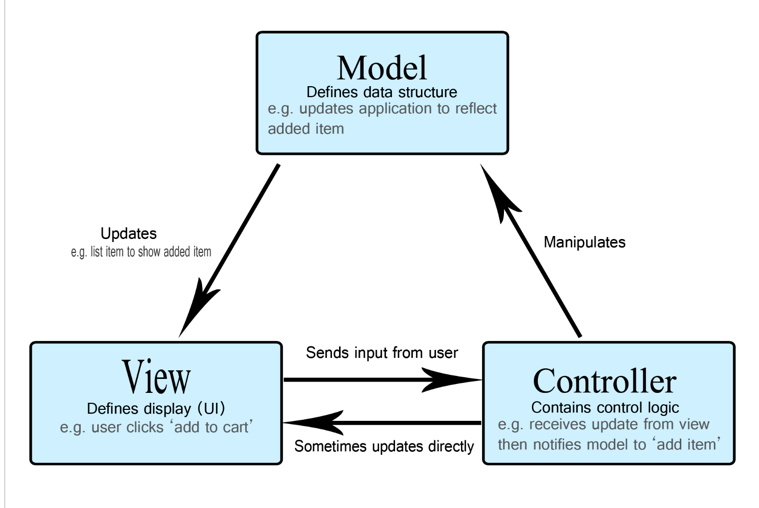
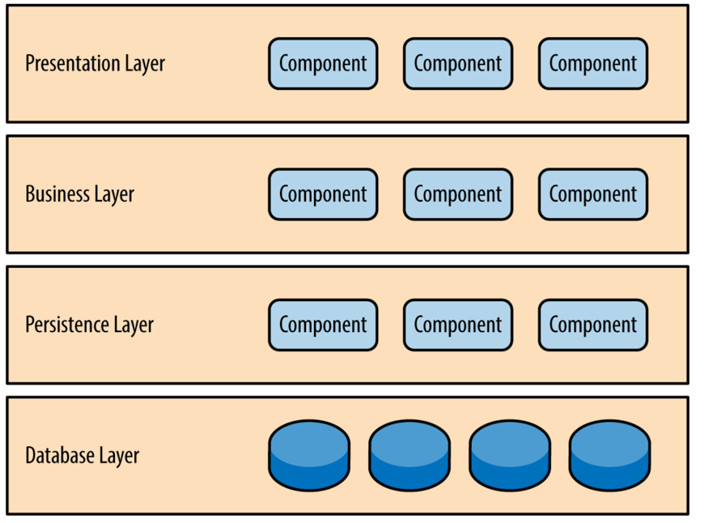

[Devinterview-io/nodejs-interview-questions](https://github.com/Devinterview-io/nodejs-interview-questions)
[https://gist.github.com/paulfranco/9f88a2879b7b7d88de5d1921aef2093b](https://gist.github.com/paulfranco/9f88a2879b7b7d88de5d1921aef2093b)


# Table of Contents by topics

| Index | No.      | Questions                                                                                                                                                              | Priority |
|-------|----------|------------------------------------------------------------------------------------------------------------------------------------------------------------------------|----------|
|       | **1**    | **Node.js**                                                                                                                                                            |          |
| 1     | 1.1      | [What is Node.js?](#11-what-is-nodejs)                                                                                                                                 | High     |
| 2     | 1.2      | [When to use Node.js and when not to use it?](#12-when-to-use-nodejs-and-when-not-to-use-it)                                                                           | Medium   |
| 3     | 1.3      | [What is package.json?](#13-what-is-packagejson)                                                                                                                       | High     |
| 4     | 1.4      | [What is the difference between dependencies and devDependencies in package.json?](#14-what-is-the-difference-between-dependencies-and-devdependencies-in-packagejson) | Low      |
| 5     | 1.5      | [What is npm?](#15-what-is-npm)                                                                                                                                        | Medium   |
| 6     | 1.6      | [What is the difference between Sync vs Async operations?](#16-what-is-the-difference-between-sync-vs-async-operations)                                                | Medium   |
| 7     | 1.7      | [How Event Loop works?](#17-how-event-loop-works)                                                                                                                      | High     |
| 8     | 1.8      | [Is Node.js entirely based on a single-thread?](#18-is-nodejs-entirely-based-on-a-single-thread)                                                                       | High     |
| 9     | 1.9      | [What is the Event Emitter class? How it is related to other classes?](#19-what-is-the-event-emitter-class-how-it-is-related-to-other-classes)                         | Low      |
| 10    | 1.10     | [What kinds of streams does Node.js have?](#110-what-kinds-of-streams-does-nodejs-have)                                                                                | High     |
| 11    | 1.11     | [When Streams can be used in Node.js?](#111-when-streams-can-be-used-in-nodejs)                                                                                        | Medium   |
| 12    | 1.12     | [What are the differences between worker thread and child_process?](#112-what-are-the-differences-between-worker-thread-and-child-process)                             | Low      |
| 13    | 1.13     | [What is the difference between commonJS and ES modules?](#113-what-is-the-difference-between-commonjs-and-es-modules)                                                 | Low      |
| 14    | 1.14     | [How to force node.js to treat your  .js files as ES modules?](#114-how-to-force-nodejs-to-treat-your-js-files-as-es-modules)                                          | Low      |
| 15    | 1.15     | [What is a Memory Leak? How to prevent it?](#115-what-is-a-memory-leak-how-to-prevent-it)                                                                              | Medium   |

## 2 Dealing with async code

| Index | No.   | Questions                                                                                                                                                                                      | Priority |
|-------|-------|------------------------------------------------------------------------------------------------------------------------------------------------------------------------------------------------|----------|
|       | **2** | **Dealing with async code**                                                                                                                                                                    |          |
| 16    | 2.1   | [How do you understand the Callback Pattern? What is a callback hell?](#21-how-do-you-understand-the-callback-pattern-what-is-a-callback-hell)                                                 | High     |
| 17    | 2.2   | [What is a Promise?](#22-what-is-a-promise)                                                                                                                                                    | High     |
| 18    | 2.3   | [What states do the Promise have? Can the state be changed once it was fulfilled or rejected?](#23-what-states-do-the-promise-have-can-the-state-be-changed-once-it-was-fulfilled-or-rejected) | High     |
| 19    | 2.4   | [What are the advantages of the async/await over Promises?](#24-what-are-the-advantages-of-the-asyncawait-over-promises)                                                                       | Medium   |
| 20    | 2.5   | [What is Promisification and when it is used?](#25-what-is-promisification-and-when-it-is-used)                                                                                                | Low      |

## 3 Express.js

| Index | No.   | Questions                                                                                              | Priority |
|-------|-------|--------------------------------------------------------------------------------------------------------|----------|
|       | **3** | **Express.js**                                                                                         |          |
| 21    | 3.1   | [What is Express.js and what is its use?](#31-what-is-expressjs-and-what-is-its-use)                   | Medium   |
| 22    | 3.2   | [What are the main building blocks of Express.js?](#32-what-are-the-main-building-blocks-of-expressjs) | Medium   |
| 23    | 3.3   | What are the purposes for middlewares in Express.js?                                                   | High     |
| 24    | 3.4   | What is the use of **next** in Express.js?                                                             | Medium   |
| 25    | 3.5   | How can you differ an error handling function from a request handler function?                         | Low      | 

## 4 NestJS

| Index | No.   | Questions                                                                           | Priority |
|-------|-------|-------------------------------------------------------------------------------------|----------|
|       | **4** | **NestJS**                                                                          |          |
| 26    | 4.1   | What can be a Provider in NestJS?                                                   | Low      |
| 27    | 4.2   | What are the use cases for Pipes in NestJS?                                         | Low      |
| 28    | 4.3   | Is there a possibility to bind extra logic before/after method execution in NestJS? | Low      |
| 29    | 4.4   | How all unhandled exceptions are processed in NestJS?                               | Low      |

## 5 Monitoring and Logging

| Index | No.   | Questions                                                         | Priority |
|-------|-------|-------------------------------------------------------------------|----------|
|       | **5** | **Monitoring and Logging**                                        | Low      |
| 30    | 5.1   | What is a Health check? Why do we need it?                        | Low      |
| 31    | 5.2   | What is a correlation ID? How it helps to debug your application? | Low      |

## 6 Testing

| Index | No.   | Questions                                                             | Priority |
|-------|-------|-----------------------------------------------------------------------|----------|
|       | **6** | **Testing**                                                           |          |
| 32    | 6.1   | What is a test pyramid? How can you implement it regarding HTTP APIs? | High     |
| 33    | 6.2   | What is a Given-When-Then pattern?                                    | Medium   |
| 34    | 6.3   | What mocks and stubs are? How are they used in integration testing?   | Medium   |
| 35    | 6.4   | What test runner libraries do you know?                               | Low      |
| 36    | 6.5   | What is Unit-testing? What are the FIRST principles?                  | High     |

## 7 Software design

| Index | No.   | Questions                                                                                                                                                           | Priority |
|-------|-------|---------------------------------------------------------------------------------------------------------------------------------------------------------------------|----------|
|       | **7** | **Software design**                                                                                                                                                 |          |
| 37    | 7.1   | [REST API: What is it?](#71-rest-api-what-is-it)                                                                                                                    | High     |
| 38    | 7.1.1 | [REST API: What are the Levels of REST API?](#711-rest-api-what-are-the-levels-of-rest-api)                                                                         | Low      |
| 39    | 7.1.2 | [REST API: What constraints does the REST have?](#712-rest-api-what-constraints-does-the-rest-have)                                                                 | Medium   |
| 40    | 7.1.3 | [REST API: Name the main Http methods. What is the difference between Put and Patch?](#713-rest-api-name-the-main-http-methods)                                     | High     |
| 41    | 7.1.4 | [REST API: What status should be sent in a response to a create object request?](#714-rest-api-what-status-should-be-sent-in-a-response-to-a-create-object-request) | Medium   |
| 42    | 7.2   | [Explain the MVC model](#72-explain-the-MVC-model)                                                                                                                  | High     |
| 43    | 7.3   | [What is GraphQL? What are its advantages over REST API?](#73-what-is-GraphQl)                                                                                      | Low      |
| 44    | 7.4   | [Name the key principles of OOP?](#74-name-the-key-principles-of-OOP)                                                                                               | High     |
| 45    | 7.5   | [What is a dependency injection?](#75-What-is-a-dependency-injection)                                                                                               | Medium   |
| 46    | 7.6   | [What is a Layered Architecture? Give a few examples](#76-What-is-a-Layered-Architecture)                                                                           | Medium   |

## 8 Databases

| Index | No.      | Questions                                                        | Priority |
|-------|----------|------------------------------------------------------------------|----------|
|       | **8**    | **Databases**                                                    |          |
|       | 8.1      | **_RDBMS_ (Postgres or MySQL)**                                  |          |
| 47    | 8.1.0    | [RDBMS: What is it?](#810-rdbms-what-is-it)                      | High     |
| 48    | 8.1.1    | How data is stored in RDBMS?                                     | High     |
| 49    | 8.1.2    | What is a normalization concept?                                 | Medium   |
| 50    | 8.1.3    | What table relationships do you know? How to create them?        | Medium   |
| 51    | 8.1.4    | What is the difference between DDL and DML?                      | Medium   |
| 52    | 8.1.5    | What data types are presented in PostgresSQL?                    | Low      |
| 53    | 8.1.6    | How tables can be joined?                                        | High     |
| 54    | 8.1.7    | What is a sub query?                                             | Low      |
| 55    | 8.1.8    | Explain Transactions and ACID.                                   | High     |
| 56    | 8.1.9    | What are Lock Levels in Postgres?                                | Low      |
| 57    | 8.1.10   | What type of indexes do you know? When to use them?              | High     |
| 58    | 8.1.11   | What is ORM? What problems does it solve?                        | Low      |
|       | 8.1.12   | **TypeORM**                                                      |          |
| 59    | 8.1.12.1 | - What is the Query Builder?                                     | Low      |
| 60    | 8.1.12.2 | - What are Active Record and Data Mapper patterns?               | Low      |
| 61    | 8.1.12.3 | - What is the difference between Raw Entities and Entities?      | Low      |
| 62    | 8.1.12.4 | - How to process tables with a lot of data inside with typeorm?  | Low      |
| 63    | 8.1.12.5 | - How to change an already defined table structure with typeorm? | High     |
|       | 8.2      | **_NoSQL DB_**                                                   |          |
| 64    | 8.2.1    | What is MongoDB?                                                 | High     |
| 65    | 8.2.2    | How data is organized in MongoDB?                                | Medium   |
| 66    | 8.2.3    | What does the BASE stand for?                                    | Medium   |
| 67    | 8.2.4    | How to make a relationship between Documents in MongoDB?         | Medium   |
| 68    | 8.2.5    | How scaling of NoSQL and SQL databases differs?                  | High     |

## 9 Security

| Index | No.   | Questions                                                          | Priority |
|-------|-------|--------------------------------------------------------------------|----------|
|       | **9** | **Security**                                                       |          |
| 69    | 9.1   | What is the difference among Encoding, Encryption and Hashing?     | Medium   |
| 70    | 9.2   | What are the use cases for Encoding, Encryption and Hashing?       | Medium   |
| 71    | 9.3   | How do you understand symmetric and asymmetric encryption?         | Low      |
| 72    | 9.4   | What is the difference between private and public key?             | Low      |
| 73    | 9.5   | What is HTTPS? How it works?                                       | Medium   |
| 74    | 9.6   | What is Authentication and Authorization?                          | Medium   |
| 75    | 9.7   | What is JWT? Is it safe to store sensitive information inside JWT? | High     |
| 76    | 9.8   | What types of Authentication do you know? When to use them?        | Low      |

## 10 General questions

| Index | No.    | Questions                                                                       | Priority |
|-------|--------|---------------------------------------------------------------------------------|----------|
|       | **10** | **General questions**                                                           |          |
| 77    | 13.1   | Name the main advantages of Microservice architecture over Monolith             | Medium   |
| 78    | 13.2   | How do you understand an event-driven architectures? What is a pub-sub pattern? | Medium   |
| 79    | 13.3   | What is a 3-tier WEB Application? Are the tiers logical or physical?            | Low      |

---
## 1 Answers Node.js

### 1.1 What is NodeJS?

**NodeJS** is an open-source, cross-platform, JavaScript runtime environment that executes JavaScript code outside a browser. Node JS was created by Ryan Dahl, Ryan Dahl is a software engineer and the original developer of the Node.js JavaScript runtime.

> **References:**
>
> - [NodeJS.org](https://nodejs.org/en/about/)
 
 **[ Back to Top ⬆ ](#table-of-contents-by-topics)**

---

### 1.2 When to use NodeJs and when not to use it?

**What is Node.js used for?**
* Real-time applications
* IoT applications.
* Collaborative tools
* Data streaming applications
* Applications relying on scalability

**When is Node.js not a good idea?**
* Applications with heavy computing server-side.
* CRUD applications.
* Server-side web applications with relational databases.

> **References:**
>
> - [Why and When to Use Node.js](https://relevant.software/blog/why-and-when-to-use-node-js/)

**[ Back to Top ⬆ ](#table-of-contents-by-topics)**

---

### 1.3 What is package.json?
The package.json file in Node.js is the heart of the entire application. It is basically the manifest file that contains the metadata of the project where we define the properties of a package.
> **References:**
>
> - [The Basics of Package.json](https://nodesource.com/blog/the-basics-of-package-json)

**[ Back to Top ⬆ ](#table-of-contents-by-topics)**

---

### 1.4 What is the difference between dependencies and devDependencies in package.json?
`dependencies` are the modules that project requires to function effectively on production.    
`devDependencies` are the modules that is needed by the developer during development.  

also we have:  
`peerDependencies` are the modules that is needed when you creating npm packages.    

> **References:**
>
> - [dependencies && devDependencies && peerDependencies](https://www.geeksforgeeks.org/difference-between-dependencies-devdependencies-and-peerdependencies/)
> - [dependencies && devDependencies && peerDependencies youtube](https://www.youtube.com/watch?v=SwBbPQWNP9k)
> - [dependencies youtube](https://www.youtube.com/watch?v=Sl5cK0if0xY)
> - [devDependencies youtube](https://www.youtube.com/watch?v=_urfyYFfyjU)
> - [peerDependencies youtube](https://www.youtube.com/watch?v=0l9YLCk0wOo)

**[ Back to Top ⬆ ](#table-of-contents-by-topics)**

---

### 1.5 What is npm?
npm (Node Package Manager) is the default package manager for Node.js. It makes it possible to install packages, manage dependencies and versions of the packages we use

NPM is a package manager for Node.js packages, or modules if you like.
www.npmjs.com hosts thousands of free packages to download and use.
The NPM program is installed on your computer when you install Node.js
> **References:**
>
> - [What is NPM?](https://www.w3schools.com/nodejs/nodejs_npm.asp#:~:text=What%20is%20NPM%3F,to%20run%20on%20your%20computer!)
> - [Node.js | NPM (Node Package Manager)](https://www.geeksforgeeks.org/node-js-npm-node-package-manager/)

**[ Back to Top ⬆ ](#table-of-contents-by-topics)**

---

### 1.6 What is the difference between Sync vs Async operations?
**Synchronous** code is also called “blocking” as it halts the program until all the resources are available.

Synchronous execution usually uses to code executing in sequence and the program is executed line by line, one line at a time. When a function is called, the program execution waits until that function returns before continuing to the next line of code.

**Asynchronous** code is also known as “non-blocking”. The program continues executing and doesn't wait for external resources (I/O) to be available.

Asynchronous execution applies to execution that doesn't run in the sequence it appears in the code. The program doesn't wait for the task to complete and can move on to the next task.

> **References:**
>
> - [What is Synchronous vs. Asynchronous in Node.js](https://medium.com/linkit-intecs/what-is-synchronous-vs-asynchronous-in-node-js-4b45ee668e6f)
> - [Difference between synchronous and asynchronous method of fs module](https://www.geeksforgeeks.org/difference-between-synchronous-and-asynchronous-method-of-fs-module/)

**[ Back to Top ⬆ ](#table-of-contents-by-topics)**

---

### 1.7 How Event Loop works?


Phases Overview:  
`Phases: nextTickQueue mickrotasks Queue`  
**timers**: this phase executes callbacks scheduled by setTimeout() and setInterval().  
`Phases: nextTickQueue mickrotasks Queue`  
**pending callbacks**: executes I/O callbacks deferred to the next loop iteration.  
`Phases: nextTickQueue mickrotasks Queue`  
**idle, prepare**: only used internally.  
`Phases: nextTickQueue mickrotasks Queue`  
**poll**: retrieve new I/O events; execute I/O related callbacks (almost all with the exception of close callbacks, the ones scheduled by timers, and setImmediate()); node will block here when appropriate.  
`Phases: nextTickQueue mickrotasks Queue`  
**check**: setImmediate() callbacks are invoked here.  
`Phases: nextTickQueue mickrotasks Queue`  
**close callbacks**: some close callbacks, e.g. socket.on('close', ...).
`Phases: nextTickQueue mickrotasks Queue`

Between each of these phases there is a phase with next and nextTickQueue microtasks Queue

> **References:**
>
> - [What is the Event Loop?](https://nodejs.org/en/docs/guides/event-loop-timers-and-nexttick/#:~:text=Event%20Loop%20Explained,begins%20processing%20the%20event%20loop.)
> - [Event loop в Node.js youtube](https://www.youtube.com/watch?v=7f787SsgknA)
> - [Node.js #1: Что такое событийный цикл? (Events loop) youtube](https://www.youtube.com/watch?v=n6I0OQY6CFU)

**[ Back to Top ⬆ ](#table-of-contents-by-topics)**

---

### 1.8 Is Node.js entirely based on a single-thread?
NodeJS uses "Single Threaded Event Loop Model" architecture to handle multiple operations. However, libuv works multi-thread behind the scene.

> **References:**
>
> - [What exactly is Node.js?](https://www.freecodecamp.org/news/what-exactly-is-node-js-ae36e97449f5/)
> - [Is Node.js Single-Threaded or Multi-Threaded? and Why?](https://dev.to/arealesramirez/is-node-js-single-threaded-or-multi-threaded-and-why-ab1)
> - [Многопоточность в Node.js](https://tproger.ru/translations/guide-to-threads-in-node-js/)

**[ Back to Top ⬆ ](#table-of-contents-by-topics)**

---

### 1.9 What is the Event Emitter class? How it is related to other classes?

Events module in Node.js allows us to create and handle custom events. The Event module contains “EventEmitter” class which can be used to raise and handle custom events. It is accessible via the following code.

``` JavaScript
// Import events module
var events = require('events');

// Create an eventEmitter object
var eventEmitter = new events.EventEmitter();
```

When an EventEmitter instance encounters an error, it emits an “error” event. When a new listener gets added, it fires a “newListener” event and when a listener gets removed, it fires a “removeListener” event.
EventEmitter provides multiple properties like “on” and “emit”. The “on” property is used to bind a function to the event and “emit” is used to fire an event.

or

Event Emitters
EventEmitter is a class that helps us create a publisher-subscriber pattern in NodeJS.

With an event emitter, we can simply raise a new event from a different part of an application, and a listener will listen to the raised event and have some action performed for the event.

> **References:**
>
> - [Node Event Emitters — For Beginners and Experts](https://medium.com/developers-arena/nodejs-event-emitters-for-beginners-and-for-experts-591e3368fdd2)
> - [Events](https://nodejs.org/docs/latest/api/events.html)

**[ Back to Top ⬆ ](#table-of-contents-by-topics)**

---

### 1.10 What kinds of streams does Node.js have?
Streams are objects that allow the reading of data from the source and writing of data to the destination as a continuous process.  

There are four types of streams:
**Writable** streams are the streams that data can be written on.  
**Readable** streams are the streams that data can be read from.  
**Duplex** streams are both readable and writeable streams.  
**Transform** streams are Duplex streams that can modify the data while being written and read.

Advantages of Streams over other data handling methods:

**Time Efficient:** We don’t have to wait until entire file has been transmitted. We can start processing data as soon as we have it.  
**Memory Efficient:** We don’t have to load huge amount of data in memory before we start processing.

> **References:**
>
> - [Types of streams (https://nodejs.org/)](https://nodejs.org/api/stream.html#types-of-streams)
> - [How to use streams in Node.js]( https://fauna.com/blog/how-to-use-node-js-streams)
> - [Node.js Streams](https://www.geeksforgeeks.org/node-js-streams/)
> - [Node.js Streams](https://www.javatpoint.com/nodejs-streams)
> - [Node.js Stream Module](https://www.w3schools.com/nodejs/ref_stream.asp)
> - [Understanding Node Streams](https://medium.com/technofunnel/working-with-node-js-streams-c65eb622eebb)

**[ Back to Top ⬆ ](#table-of-contents-by-topics)**

---

### 1.11 When Streams can be used in Node.js?

Streams can be used when we are reading, writing, reading-writing or modifying data over a network or within the system

> **References:**
>
> - [Streams](https://nodejs.org/api/stream.html#stream)
> - [read question What kinds of streams does Node.js have?](#110-what-kinds-of-streams-does-nodejs-have) 

**[ Back to Top ⬆ ](#table-of-contents-by-topics)**

---

### 1.12 What are the differences between worker thread and child process?
* child_process provides the ability to spawn new processes (child node.js processes) that have their own memory. The communication between these processes is established through IPC (inter-process communication) provided by the operating system.
* Worker threads are threads of a process (node.js process). They use the shared memory space.
* So the difference between worker threads and child processes is same as the difference between a thread and a process.

> **References:**
>
> - [Single thread vs child process vs worker threads vs cluster in nodejs
    ](https://alvinlal.netlify.app/blog/single-thread-vs-child-process-vs-worker-threads-vs-cluster-in-nodejs)

**[ Back to Top ⬆ ](#table-of-contents-by-topics)**

---

### 1.13 What is the difference between commonJS and ES modules?
CommonJS module system is the default module system within Nodejs. ES Modules were introduced as a new standard.

1. CommonJS and ES Modules have different syntax and execution process for imports and exports. CommonJS imports are dynamically resolved at runtime, where ES Modules are executed at parse time. (The major difference in commonjs and ES module is of synchronous and asynchronous nature: commonjs modules are synchronous, loading and parsing of ES modules is asynchronous.) 
2. File Extensions are another difference between CommonJS and ES Modules Files with `.js` extension are treated as CommonJS Modules and files with `.mjs` extension are treated as ES Modules.


Compare syntax:

CommonJS:  
```
module.exports.add = function(a, b) {
  return a + b;
}

// then in index.js
const { add } = require('./util')
console.log(add(5, 5));
```
ES Modules:
```
export function add(a, b) {
   return a + b;
}

// then in index.js
import { add } from './util.mjs'

console.log(add(5, 5));
```
> **References:**
>
> - [CommonJS vs. ES Modules](https://reflectoring.io/nodejs-modules-imports/)

**[ Back to Top ⬆ ](#table-of-contents-by-topics)**

---

### 1.14 How to force node.js to treat your .js files as ES modules?
We can use `.mjs` file extension and specify that we're using `type: module` in our `package.json` file while using ES6 import/export syntax for our modules.

However, you might want to configure your NodeJS project to use ES Modules as the default module system. Please consult the [NodeJS documentation on file extensions](https://nodejs.org/api/packages.html#packagejson-and-file-extensions) to find out how to correctly configure your project.

> **References:**
>
> - [CommonJS vs. ES Modules](https://reflectoring.io/nodejs-modules-imports/)

**[ Back to Top ⬆ ](#table-of-contents-by-topics)**

---

### 1.15 What is a Memory Leak? How to prevent it?

**Memory Leak** occurs when an unused block of memory is still on the heap managed by v8. Memory Leaks can be caused by global variables which run during the whole execution, multiple references to an object, closures that holds reference to a large object, timers such as setTimeOut, setInterval when their callbacks are not properly handled.

On the subject of memory leaks in Node.js, you might want to explore AppSignal [application monitoring for Node.js](https://www.appsignal.com/nodejs) as well. It ships with a dashboard that shows the size of your heap, and the currently active top-level contexts. No instrumentation needed.
> **References:**
>
> - [Avoiding Memory Leaks in Node.js: Best Practices for Performance](https://blog.appsignal.com/2020/05/06/avoiding-memory-leaks-in-nodejs-best-practices-for-performance.html)
> - [https://devcenter.heroku.com/articles/node-memory-use#what-is-a-memory-leak](https://devcenter.heroku.com/articles/node-memory-use#what-is-a-memory-leak)

**[ Back to Top ⬆ ](#table-of-contents-by-topics)**

---

## 2 Answers Dealing with async code

### 2.1 How do you understand the Callback Pattern? What is a callback hell?

A callback is a function passed as an argument to another function. In Node.js a callback function is called at the completion of a given task. It is a base of node.js asynchronous behaviour. Basically, you should follow the **error callback convention**:

1. the callback is the last parameter;
2. the callback gets called after the function is done with all of its operations;
3. the first parameter of the callback is the error value;
4. if the function hits an error, it will call the callback with an error as a first parameter. Else it will call the callback with a null and rest parameters with data.

The callback hell happens when you put one callback inside other, again and again. It typically looks like this:

```jsx
fs.readdir(source, function (err, files) {
    if (err) {
     console.log('Error finding files: ' + err)
    } else {
        files.forEach(function (filename, fileIndex) {
             console.log(filename)
             gm(source + filename).size(function (err, values) {
                 if (err) {
                 console.log('Error identifying file size: ' + err)
                 } else {
                 console.log(filename + ' : ' + values)
                 aspect = (values.width / values.height)
                 widths.forEach(function (width, widthIndex) {
                     height = Math.round(width / aspect)
                     console.log('resizing ' + filename + 'to ' + height + 'x' + height)
                     this.resize(width, height).write(dest + 'w' + width + '_' + filename, function(err) {
                         if (err) console.log('Error writing file: ' + err)
                     })
                     }.bind(this))
                 }
             })
        })
    }
})
```

How can you avoid callback hells?
There are lots of ways to solve the issue of callback hells:
1. modularization: break callbacks into independent functions,
2. use a control flow library, like async.
3. use generators with Promises,
4. use async/await (note that it is only available in the latest v7 release and not in the LTS version

> **References:**
>
> - [Asynchronous JavaScript Patterns Working With Callbacks](https://betterprogramming.pub/async-js-patterns-using-callback-5c388ac45ac5)
> - [The callback pattern](https://subscription.packtpub.com/book/web-development/9781783287314/1/ch01lvl1sec10/the-callback-pattern)
> - [Introducing asynchronous JavaScript](https://developer.mozilla.org/en-US/docs/Learn/JavaScript/Asynchronous/Introducing)
> - [JavaScript Patterns: The Callback Pattern YouTube](https://www.youtube.com/watch?v=tBjvWZn9fvs)

**[ Back to Top ⬆ ](#table-of-contents-by-topics)**  
**[ Back to Dealing with async code ⬆ ](#2-dealing-with-async-code)**

---

### 2.2 What is a Promise?
A **Promise** is a proxy for a value not necessarily known when the promise is created. It allows you to associate handlers with an asynchronous action's eventual success value or failure reason. This lets asynchronous methods return values like synchronous methods: instead of immediately returning the final value, the asynchronous method returns a promise to supply the value at some point in the future.

A Promise is in one of these states:

* `pending`: initial state, neither fulfilled nor rejected.
* `fulfilled`: meaning that the operation was completed successfully.
* `rejected`: meaning that the operation failed.


A simple example of a Promise:
```js
const myPromise = new Promise((resolve, reject) => {
    setTimeout(() => {
        resolve('foo');
    }, 300);
});

myPromise
    .then(handleFulfilled)
    .catch(handleRejected);

// or it can be chained
myPromise
    .then(handleFulfilledA, handleRejectedA)
    .then(handleFulfilledB, handleRejectedB)
    .then(handleFulfilledC, handleRejectedC);
```

```js

const wait = time => new Promise((resolve) => setTimeout(resolve, time));

wait(3000).then(() => console.log('Hello!')); // 'Hello!'
```
The Promise class offers four static methods to facilitate async task concurrency:

Promise.all()
Fulfills when all the promises fulfill; rejects when any of the promises rejects.

`Promise.allSettled()`
Fulfills when all promises settle.

`Promise.any()`
Fulfills when any of the promises fulfills; rejects when all the promises reject.

`Promise.race()`
Settles when any of the promises settles. In other words, fulfills when any of the promises fulfills; rejects when any of the promises rejects.

> **References:**
>
> - [Master the JavaScript Interview: What is a Promise?](https://medium.com/javascript-scene/master-the-javascript-interview-what-is-a-promise-27fc71e77261)
> - [Using promises](https://developer.mozilla.org/en-US/docs/Web/JavaScript/Guide/Using_promises)
> - [Promise](https://developer.mozilla.org/en-US/docs/Web/JavaScript/Reference/Global_Objects/Promise)
> - [Promise.all()](https://developer.mozilla.org/ru/docs/Web/JavaScript/Reference/Global_Objects/Promise/all)
> - [Promise.allSettled()](https://developer.mozilla.org/ru/docs/Web/JavaScript/Reference/Global_Objects/Promise/allSettled)
> - [Promise.race()](https://developer.mozilla.org/ru/docs/Web/JavaScript/Reference/Global_Objects/Promise/race)
> - [Promise.any()](https://developer.mozilla.org/ru/docs/Web/JavaScript/Reference/Global_Objects/Promise/any)

**[ Back to Top ⬆ ](#table-of-contents-by-topics)**  
**[ Back to Dealing with async code ⬆ ](#2-dealing-with-async-code)**

---

### 2.3 What states do the Promise have? Can the state be changed once it was fulfilled or rejected?
A Promise is in one of these states:

* `pending`: initial state, neither fulfilled nor rejected.
* `fulfilled`: meaning that the operation was completed successfully.
* `rejected`: meaning that the operation failed.

Once the promise state is changed to fulfilled or rejected, it cannot be changed again

> **References:**
>
> - [Master the JavaScript Interview: What is a Promise?](https://medium.com/javascript-scene/master-the-javascript-interview-what-is-a-promise-27fc71e77261)

**[ Back to Top ⬆ ](#table-of-contents-by-topics)**  
**[ Back to Dealing with async code ⬆ ](#2-dealing-with-async-code)**

---

### 2.4 What are the advantages of the async/await over Promises?
* Async/Await is a syntactic sugar for promises, a wrapper making the code execute more synchronously.
* Using Async/Await makes it easier to read and understand the flow of the program as compared to promise chains.
* You can handle an exception thrown inside async function using try{}catch(e){} block

Compare syntax
```js
// Promise
const helperPromise = function () {
    const promise = new Promise(function (resolve, reject) {
    const x = "geeksforgeeks";
    const y = "geeksforgeeks";
    if (x === y) {
        resolve("Strings are same");
    } else {
        reject("Strings are not same");
    }
    });

    return promise;
};

// async/await
async function demoPromise() {
    try {
        let message = await helperPromise();
        console.log(message);
    } catch (error) {
    console.log("Error: " + error);
    }
}

demoPromise();
```

> **References:**
>
> - [Async/Await vs Promises](https://dev.to/deadwin19/5-reasons-why-javascript-async-await-over-promises-1if3)
> - [Difference between promise and async await in Node.js](https://www.geeksforgeeks.org/difference-between-promise-and-async-await-in-node-js/)

**[ Back to Top ⬆ ](#table-of-contents-by-topics)**  
**[ Back to Dealing with async code ⬆ ](#2-dealing-with-async-code)**

---

### 2.5 What is Promisification and when it is used?
Promisification is the conversion of a function that takes a callback into a function that returns a promise.

It's used for having cleaner and more maintainable code with a better error handling and prevent memory leaks caused by callback behaviour.

```js
const util = require('util')
const fs = require('fs')

const readdir = util.promisify(fs.readdir)

readdir('process.cwd()')
    .then(files => {
    console.log(files)
})
    .catch(err => {
    console.log(err)
})
```


> **References:**
>
> - [Promisification](https://javascript.info/promisify)
> - [How to Write Your Own Promisify Function](https://www.freecodecamp.org/news/write-your-own-promisify-function-from-scratch/)
> - [Промисификация функций в JavaScript](https://www.youtube.com/watch?v=ioypmC1oML0)

**[ Back to Top ⬆ ](#table-of-contents-by-topics)**  
**[ Back to Dealing with async code ⬆ ](#2-dealing-with-async-code)**

---

## 3 Answers Express.js

### 3.1 What is Express.js and what is its use?
Express is a node js web application framework that provides broad features for building web and mobile applications. It is used to build a single page, multipage, and hybrid web application.

It's a layer built on the top of the Node js that helps manage servers and routes.

Why Express JS?
* Express was created to make APIs and web applications with ease,
* It saves a lot of coding time almost by half and still makes web and
* mobile applications are efficient.
* Another reason for using express is that it is written in javascript as javascript is an easy language even if you don't have a previous
* knowledge of any language. Express lets so many new developers enter the field of web development.
The reason behind creating an express framework for node js is:

* Time-efficient
* Fast
* Economical
* Easy to learn
* Asynchronous

> **References:**
>
> - [Express/Node introduction](https://developer.mozilla.org/en-US/docs/Learn/Server-side/Express_Nodejs/Introduction)
> - [What is Express.js?](https://www.codecademy.com/article/what-is-express-js)
> - [Express.js](https://www.geeksforgeeks.org/express-js/)
> - [What Is Express JS In Node JS? text+video](https://www.simplilearn.com/tutorials/nodejs-tutorial/what-is-express-js#what_is_express_js)

**[ Back to Top ⬆ ](#table-of-contents-by-topics)**  
**[ Back to Express.js ⬆ ](#3-expressjs)**

---

### 3.2 What are the main building blocks of Express.js?


> **References:**
>
> - []()
> - []()
> - []()
> - [Building Blocks of ExpressJS Jingle fanny song](https://www.youtube.com/watch?v=98sZfNTqzI0)

**[ Back to Top ⬆ ](#table-of-contents-by-topics)**  
**[ Back to Express.js ⬆ ](#3-expressjs)**

---
### 3.3 What are the purposes for middlewares in Express.js?  
In Express.js, middleware plays a crucial role in handling requests and responses. The main purposes of using middleware in Express.js include:

* Request and response handling: Middleware provides functions to manipulate the request (req) and response (res) objects. This can involve modifying data, adding headers, or interrupting the processing cycle.

* Controlling the execution flow: Middleware can influence the order of route handler execution, skip or interrupt requests based on specific conditions.

* Error handling: Middleware can intercept errors occurring during request processing and take appropriate actions, such as sending error messages to clients.

* Authentication and authorization: Middleware is often used for user authentication and managing access to specific application resources.

* Logging and monitoring: Middleware can log information about requests, aiding in tracking application behavior and identifying issues.


> **References:**
>
> - []()
> - []()
> - []()

**[ Back to Top ⬆ ](#table-of-contents-by-topics)**  
**[ Back to Express.js ⬆ ](#3-expressjs)**
---

3.4   | What is the use of **next** in Express.js?                                                             | Medium   |

In Express.js, the next function is a callback representing the next middleware function in the application's request-response cycle. It is a fundamental part of middleware functions in Express.js and is crucial for controlling the flow of execution.

When a middleware function is executed, it can perform its tasks and then call the next function to pass control to the next middleware function in line. This allows middleware to be executed sequentially, each handling a specific aspect of request processing.

The next function can be used to:

Pass control to the next middleware: By invoking next(), the current middleware indicates that it has completed its tasks, and Express should proceed to the next middleware in the stack.

Skip remaining middleware: If the next function is not called, the control won't be passed to the next middleware in the stack, effectively skipping the remaining middleware functions.

Handle errors: When the next function is called with an argument (typically named err), Express interprets it as an error, and the control is passed to the error-handling middleware, allowing centralized error handling.

The next function is a mechanism for middleware to work together cohesively and maintain a structured flow of execution in an Express.js application.

---
3.5   | How can you differ an error handling function from a request handler function?                         | Low      | 

In Express.js, error handlers and request handlers differ in their signatures and usage. Here are the main differences:

Function Signature:

An error handler typically has four parameters: (err, req, res, next). The first parameter (err) represents the error that occurred in previous middleware functions.
Request handlers have three parameters: (req, res, next). They are designed to handle specific requests and do not include a parameter for error handling.
Placement in Code:

Error handlers are usually placed at the very end of the middleware stack, after all the request handlers. They serve as a fallback for handling errors that may have occurred in other parts of the application.
Request handlers are placed higher in the code and are intended for the specific handling of certain routes or types of requests.

Example of an error handler:

app.use((err, req, res, next) => {
console.error(err.stack);
res.status(500).send('Something went wrong!');
});

Example of a request handler:
app.get('/example', (req, res, next) => {
// Request handling logic
res.send('Response to example request');
});


---
5.1   | What is a Health check? Why do we need it?
A health check is a regular process in software development and system administration where the status of a system or component is periodically monitored to ensure its proper functioning. It involves regularly checking the health or state of a service, server, or application to ensure that it is operational and performing as expected.

Key Points:

Monitoring System Health: Health checks involve evaluating various metrics, such as response time, error rates, resource utilization, and more, to determine the overall health of a system.

Frequent and Automated: Health checks are often performed frequently and automatically. Automated health checks help in identifying issues promptly and enable proactive responses.

Endpoint or Route: A health check is typically implemented through a dedicated endpoint or route that returns information about the system's state.

Why it is needed:

Early Problem Detection: Enables detecting issues before they significantly impact system functionality.
Ensuring Availability: Ensures that the system remains available and ready to handle requests.
Planning Maintenance: Assists in determining suitable times for maintenance or updates.
Improving User Experience: Allows for anticipating and addressing issues, thereby enhancing the end-user experience.

---

5.2   | What is a correlation ID? How it helps to debug your application?
A Correlation ID is a unique identifier assigned to a request when it is sent, and then passed through all the components of the system involved in processing that request. This identifier is used to link various logs and events related to a specific request or transaction.

How it works:

Assignment and Transmission: When a request is sent, a unique Correlation ID is generated and assigned. This identifier is passed along with the request through all levels of the application.

Linking Information: Each component of the system through which the request passes registers its actions, including the Correlation ID. Thus, all logs and events are associated with the same identifier.

Ease of Debugging: When an issue or error occurs, logs can be analyzed using the Correlation ID to identify all events related to the request. This significantly simplifies debugging and issue identification.

How it aids in debugging the application:

Request Tracing: Enables tracing the path of a request through various components of the application.
Fault Point Identification: Facilitates pinpointing where problems or errors occur.
Performance Analysis: Allows analyzing the request execution time and identifying performance bottlenecks.
Overall, Correlation ID is a powerful tool for organizing logging and debugging in distributed systems.

---

6.1   | What is a test pyramid? How can you implement it regarding HTTP APIs?


The Test Pyramid is a testing organization concept introduced by Martin Fowler. It represents a hierarchy of different levels of tests, where tests are categorized into three main layers: the bottom layer (low strength) - unit tests, the middle layer - integration tests, and the top layer (high strength) - functional tests.

Key concepts of the Test Pyramid:

Unit Tests: These tests verify individual components or modules of the program for the correctness of their isolated functionality. They serve as the foundational building block of the test pyramid.

Integration Tests: These tests check the interaction between components or modules, as well as their proper integration into the system as a whole. They ensure the overall functionality of the system.

Functional Tests: These tests validate the functionality of the entire system, taking into account its functional requirements. They represent the top level of the Test Pyramid.

Applying the Test Pyramid to HTTP API:

Unit Tests: For an HTTP API, these can be tests for individual request handlers, checking their handling of requests, and generating correct responses.

Integration Tests: This involves verifying the interaction between different components of the HTTP API, such as between request handlers and the database. Tests may also include checking interactions with external services.

Functional Tests: These tests verify the entire API as a cohesive unit. They may involve sending HTTP requests to the API and checking the received responses, as well as testing various usage scenarios.

Advantages of Using the Test Pyramid:

Provides a broad range of checks at different levels.
Facilitates early detection and resolution of defects.
Reduces testing costs since unit tests are cheaper to maintain and execute than functional tests.

---

6.2   | What is a Given-When-Then pattern? 

The Given-When-Then pattern is a testing and specification pattern used to structure and define the steps in a test or a behavior specification. It provides a clear and consistent way of describing the conditions, actions, and expected outcomes in a test scenario.

Given: In this step, the initial conditions or prerequisites necessary for the test or scenario are established.

When: This step describes the specific action or event that triggers the execution of the test. It represents what is being tested.

Then: In this step, the expected outcomes or results of the system after the action described in the "When" step are formulated.

Example of using the pattern:
Let's consider a test for user authentication:

Given: A user exists in the system with valid credentials.
When: The user enters the correct credentials and clicks the "Login" button.
Then: The system should successfully authenticate the user and display the personal dashboard.
Advantages of Using Given-When-Then:

Clarity: Helps articulate test scenarios and system requirements clearly and concisely.
Structured Format: Provides a structured format for describing the steps of test scenarios.
Readability: Improves readability and understanding of tests for both developers and other stakeholders.

---

6.3   | What mocks and stubs are? How are they used in integration testing?

Mock and Stub are tools used in software testing to create controlled conditions and verify interactions between application components. They are applied in integration testing to emulate or substitute real objects and ensure predictable behavior.

Mock:

Definition: A mock is an object that replaces a real component and records information about how it was called.
Usage in testing: Mocks are used to verify interactions between components. They record how many times a method of an object was called and with which parameters.
Stub:

Definition: A stub is an object designed to substitute a real object and return predefined results when its methods are called.
Usage in testing: Stubs are used to create controlled conditions and return specified values or simulate certain scenarios when methods are called.
Application in Integration Testing:

Emulating external services: Using mocks and stubs allows emulating external services or dependencies to test how the system interacts with them.
Controlled conditions: Mocks and stubs provide controlled conditions for tests where specific interaction scenarios between components can be verified.


---

6.4   | What test runner libraries do you know? 

Mocha
Jest
Jasmine
Chai

---

6.5   | What is Unit-testing? What are the FIRST principles?

Unit testing is the process of verifying the correctness of individual components (units) of a program. These components could be functions, methods, classes, or even entire modules. The FIRST principles are a set of guidelines for writing effective unit tests.

Fast:

Tests should run quickly to provide rapid feedback during development. Slow tests can slow down the development process.
Independent:

Tests should be independent of each other. The outcome of one test should not affect the result of another. This ensures isolated tests and reduces the likelihood of errors.
Repeatable:

Tests should be repeatable in any execution environment. They should not depend on the environment, data, or execution order. This ensures test reliability under various conditions.
Self-Validating:

Test results should be self-validating. A test should automatically determine whether it has succeeded or failed without requiring manual verification.
Timely:

Tests should be written before the code they test. This helps prevent errors at early stages of development.
Applying these principles ensures the creation of efficient, reliable, and easily maintainable tests, which are crucial components of the development process.

---

---

### 7.0 Name of the question?


> **References:**
>
> - []()
> - []()
> - []()
> - [Displaying name](https://www.youtube.com/)

**[ Back to Top ⬆ ](#table-of-contents-by-topics)**  
**[ 7 Software design ⬆ ](#7-software-design)**

---


### 7.1 REST API: What is it?

REST API (Representational State Transfer) is a structured set of rules and constraints for building web services. This architectural style was proposed by Roy Fielding in 2000.

The key principles of REST API include:

Resources: Resources represent objects or services you want to access through the API. Resources are identified by unique URIs (Uniform Resource Identifiers).

Representation: Resources can have multiple representations (e.g., JSON, XML) that define how data can be presented.

Actions on Resources: Interaction with resources is done through standard HTTP methods such as GET (retrieve data), POST (create new data), PUT (update data), and DELETE (remove data).

Statelessness: Each client request contains all the necessary information for its execution, and the server doesn't store state between requests.

REST API is widely used for building web services that provide access to data and functionality through standard HTTP protocol interfaces.


> **References:**
>
> - [ibm.com](https://www.ibm.com/topics/rest-apis)
> - [habr](https://habr.com/ru/articles/483202/)
> - [video](https://www.youtube.com/watch?v=lsMQRaeKNDk)
> - [video](https://www.youtube.com/watch?v=qbLc5a9jdXo)

**[ Back to Top ⬆ ](#table-of-contents-by-topics)**  
**[ 7 Software design ⬆ ](#7-software-design)**

---

### 7.1.1 REST API: What are the Levels of REST API?

The levels of REST API, often referred to as Richardson Maturity Model, are a set of criteria or principles that define the sophistication and adherence to RESTful principles in a web service. There are four levels in this model:

**Level 0** - The Swamp of POX (Plain Old XML): In this level, the web service doesn't adhere to REST principles and simply uses HTTP as a transport mechanism. It often relies on a single URI for all operations and uses XML for data exchange.

**Level 1** - Resources: At this level, resources are introduced, and each resource is identified by a unique URI. However, the focus is on using HTTP methods to perform actions on resources rather than following RESTful principles.

**Level 2** - HTTP Verbs: Level 2 introduces the use of standard HTTP methods (GET, POST, PUT, DELETE) to perform actions on resources. This level also emphasizes the use of proper URIs for resources.

**Level 3** - Hypermedia Controls: The highest level of REST maturity involves the use of hypermedia controls. This means that in addition to standard HTTP methods, the API includes links and controls that guide the client on how to interact with the resources. HATEOAS (Hypermedia as the Engine of Application State) is a key principle at this level.

Reaching Level 3 implies full adherence to REST principles, allowing for a more flexible and discoverable API.

> **References:**
>
> - [4 Maturity Levels of REST API Design](https://blog.restcase.com/4-maturity-levels-of-rest-api-design/)

**[ Back to Top ⬆ ](#table-of-contents-by-topics)**  
**[ 7 Software design ⬆ ](#7-software-design)**

--- 

### 7.1.2 REST API: What constraints does the REST have?

**Client-Server Architecture**: The system is divided into client and server components, allowing them to evolve independently.

**Statelessness**: Each request from a client to a server must contain all the information needed to understand and fulfill the request. The server should not store any information about the client's state between requests.

**Cacheability**: Responses from the server can be labeled as cacheable or non-cacheable. Caching can improve efficiency and scalability.

**Uniform Interface**: A uniform and consistent set of constraints is applied to the entire system's architecture, providing a simple and standardized way to interact with resources.

**Layered System**: The architecture can be composed of multiple layers, each with a specific functionality. Each layer must only be aware of the layer directly beneath it and should not have knowledge about the layers above.

**Code on Demand (optional)**: Servers can provide executable code or scripts to clients on demand. This constraint is optional and not commonly used in typical RESTful APIs.

These constraints help create scalable, maintainable, and adaptable web services that can be easily extended or modified over time.

> **References:**
>
> - [https://www.webscrapingapi.com/](https://www.webscrapingapi.com/rest-api-architecture-constraints)
> - [https://medium.com/](https://medium.com/geekculture/rest-architectural-constraints-495a50ae0651)

**[ Back to Top ⬆ ](#table-of-contents-by-topics)**  
**[ 7 Software design ⬆ ](#7-software-design)**

---

### 7.1.3 REST API: Name the main Http methods
What is the difference between Put and Patch?

**GET**: Used to retrieve a representation of a resource.

**POST**: Used to submit data to be processed to a specified resource.

**PUT**: Used to update a current representation of a resource with a new one.

**DELETE**: Used to request the removal of a resource.

**PATCH**: Used to apply partial modifications to a resource.

**HEAD**: Similar to GET but used to retrieve only the headers of a resource.

**OPTIONS**: Used to describe the communication options for the target resource.

**TRACE** method performs a message loop-back test along the path to the target resource, providing a useful debugging mechanism.

**CONNECT** method is used to establish a tunnel, typically through a proxy server, for secure data transmission. It is often applied in the case of HTTPS connections.

Difference between PUT and PATCH:

PUT: The PUT method is used to update a resource or create a new resource if it doesn't exist. When using PUT, the entire resource is replaced with the new representation provided in the request.

PATCH: The PATCH method is used to apply partial modifications to a resource. It means that only the specified fields in the request need to be updated, leaving the rest of the resource unchanged. PATCH is useful when you want to update specific attributes without affecting the entire resource.

In summary, PUT is used for full updates, while PATCH is used for partial updates.
> **References:**
>
> - [https://www.theserverside.com/](https://www.theserverside.com/blog/Coffee-Talk-Java-News-Stories-and-Opinions/HTTP-methods)
> - [https://www.youtube.com/](https://www.youtube.com/watch?v=L1DU13XiogA&t=26s)

**[ Back to Top ⬆ ](#table-of-contents-by-topics)**  
**[ 7 Software design ⬆ ](#7-software-design)**

---

### 7.1.4 REST API: What status should be sent in a response to a create object request?
**Status Code	Description	Examples**
100 Continue with the request.	Sent by the server to indicate that it is ready to continue processing the client's request.
101 Switching Protocols	Server is indicating a switch to a different protocol.	For example, the server uses this code when switching to a WebSocket.
200 OK	The request was successful.	A GET request successfully retrieved the resource.
201 Created	The request was successful, and a new resource was created.	A POST request successfully created a new resource.
204 No Content	The request was successful, but there is no additional content.	A DELETE request successfully removed a resource.
206 Partial Content	The partial request was successful.	Used for loading parts of a file or streaming media data.
300 Multiple Choices	The request has more than one possible response.	The client can choose one of them.
301 Moved Permanently	The resource has permanently moved to a new location, and the client should request it from there.	Used for permanent redirection.
304 Not Modified	The resource has not been modified since the last request.	The client can use its cached version.
400 Bad Request	The server cannot or will not process the request due to an error on the client's part.	Invalid request, missing parameters, etc.
401 Unauthorized	The client must authenticate to get the requested response.	Missing or incorrect credentials.
403 Forbidden	The client does not have access rights to the content.	Insufficient permissions for the requested action.
404 Not Found	The requested resource could not be found.	The resource is not available on the server.
405 Method Not Allowed	The method specified in the request is not allowed for the resource.	Attempting to perform an invalid HTTP method.
409 Conflict	There is a conflict with the current state of the target resource.	For example, a conflict when attempting to create a duplicate resource.
500 Internal Server Error	A generic error message returned when an unexpected condition was encountered on the server.	Something went wrong on the server side.
503 Service Unavailable	The server is not ready to handle the request.	Used when the server is in maintenance mode or overloaded.

> **References:**
>
> - [https://www.codejava.net/](https://www.codejava.net/rest-api/http-methods-and-status-codes)
> - [https://restfulapi.net/](https://restfulapi.net/http-status-codes/)

**[ Back to Top ⬆ ](#table-of-contents-by-topics)**  
**[ 7 Software design ⬆ ](#7-software-design)**

---

### 7.2 Explain the MVC model?
MVC design layers
The MVC methodology separates an application's logic into three distinct layers:

**Model**. The model layer is responsible for the application's data logic and storing and retrieving data from back-end data stores. The model layer might also include mechanisms for validating data and carrying out other data-related tasks. This layer is responsible for maintaining all aspects of the data and ensuring its integrity and accessibility.

**View**. The view layer provides the UI necessary to interact with the application. It includes components needed to display the data and enables users to interact with that data. For example, the view layer might include buttons, links, tables, drop-down lists or text boxes.

**Controller**. The controller layer contains the application logic necessary to facilitate communications across the application, acting as an interface between the view and model layers. The controller is sometimes viewed as the brains of the application, keeping everything moving and in sync.


> **References:**
>
> - [https://www.techtarget.com/](https://www.techtarget.com/whatis/definition/model-view-controller-MVC#:~:text=The%20MVC%20methodology%20separates%20an,out%20other%20data%2Drelated%20tasks.)
> - [https://developer.mozilla.org/](https://developer.mozilla.org/en-US/docs/Glossary/MVC)


**[ Back to Top ⬆ ](#table-of-contents-by-topics)**  
**[ 7 Software design ⬆ ](#7-software-design)**

---

### 7.3 What is GraphQl?


What are its advantages over REST API?

GraphQL is a query language for your API and a runtime for executing those queries against your data. It was developed by Facebook and provides clients with the ability to request precisely the data they need, making it more flexible and efficient compared to traditional REST APIs.

Advantages of GraphQL over REST API:

**Query Flexibility:**
In GraphQL, clients define the structure of the data they want, and they receive exactly what they requested. This avoids over-fetching of data and reduces the amount of transmitted information.

**Unified Interface:**
Unlike REST, GraphQL doesn't require different API endpoints for different queries. A single endpoint serves all queries, making the API more straightforward and easier to use.

**Reduced Number of Requests:**
GraphQL allows fetching all the necessary data in a single request, while in REST, multiple requests might be needed for the same information. This reduces the number of requests and minimizes latency.

**Auto-Documentation:**
GraphQL automatically generates documentation for your API based on the schema, making it easier for clients to understand what data they can request.

**Elimination of Over-fetching:**
Unlike REST, where clients may receive excess or unnecessary data, GraphQL ensures an exact match between the query and the response, saving bandwidth and speeding up data retrieval.

> **References:**
>
> - [https://blog.logrocket.com/](https://blog.logrocket.com/graphql-vs-rest-api-why-you-shouldnt-use-graphql/)
> - [https://mobilelive.medium.com/](https://mobilelive.medium.com/graphql-vs-rest-api-and-reasons-you-should-use-graphql-f6cfd0c357b8)
> - [https://www.youtube.com/](https://www.youtube.com/watch?v=PTfZcN20fro)

**[ Back to Top ⬆ ](#table-of-contents-by-topics)**  
**[ 7 Software design ⬆ ](#7-software-design)**

---

### 7.4 Name the key principles of OOP?

Object-Oriented Programming (OOP) is based on several key principles. Here are the main principles of OOP:

**Encapsulation:**
Hiding the internal details of an object and providing access only to the necessary information. Objects have internal states, and their details can be protected from direct access.

**Inheritance:**
The ability to create new classes based on existing (parent) classes. The new class, called a subclass, inherits the properties and methods of the parent and can add or modify them.

**Polymorphism:**
The ability of objects to use methods with the same name but with different implementations. Polymorphism allows the same method to be called for different objects, which simplifies the code and makes it more flexible.

**Abstraction:**
Separating abstract concepts from their specific implementations. Classes and interfaces can serve as abstractions that define common characteristics and behavior, regardless of the specific implementation.

> **References:**
>
> - [https://seramasumi.github.io/docs](https://seramasumi.github.io/docs/Tech%20Knowledge/The%20four%20principles%20of%20OOP.html)
> - [https://www.youtube.com/](https://www.youtube.com/watch?v=YpYLXq4htKY)

**[ Back to Top ⬆ ](#table-of-contents-by-topics)**  
**[ 7 Software design ⬆ ](#7-software-design)**

---

### 7.5 What is a dependency injection?

Dependency Injection (DI) is a design pattern in software development that allows objects to receive dependencies from an external source rather than creating them internally. It aims to decouple the components of a system by allowing them to be independent of their dependencies' concrete implementations.

Here's the example of using dependency injection in JavaScript with classes:

javascript
Copy code
```
// Class EmailService responsible for sending emails
class EmailService {
    sendEmail(recipient, message) {
    // Logic for sending an email
        console.log(`Email sent to ${recipient}: ${message}`);
    }
}

// Class UserService that depends on EmailService
class UserService {
    constructor(emailService) {
        this.emailService = emailService;
    }

    registerUser(username, email) {
        // Logic for registering a user
        this.emailService.sendEmail(email, "Welcome!");
        console.log(`User ${username} registered with email ${email}`);
    }
}

// Creating an instance of EmailService
const emailService = new EmailService();

// Creating an instance of UserService with dependency injection (emailService)
const userService = new UserService(emailService);

// Registering a user using UserService
userService.registerUser("Alice", "alice@example.com");
```

In this example, UserService accepts the EmailService dependency through its constructor. When creating an instance of UserService, we pass it an instance of EmailService. This makes UserService more flexible and independent of the concrete implementation of sending emails.

Thus, if we need to change or replace the email sending service, we don't have to modify the code inside UserService, making our program more modular and easily maintainable.

> **References:**
>
> - [https://stackify.com/](https://stackify.com/dependency-injection/)

**[ Back to Top ⬆ ](#table-of-contents-by-topics)**  
**[ 7 Software design ⬆ ](#7-software-design)**

---

### 7.6 What is a Layered Architecture?
Give a few examples

Layered Architecture is a methodology of software design where an application is divided into separate layers, with each layer responsible for a specific aspect of functionality. Each layer provides a certain level of abstraction and is responsible for performing specific tasks.

Here are a few examples of layered architecture:

**Three-Tier Architecture:**
* Presentation Layer: Responsible for displaying the user interface and interacting with the user. This can be a web interface, mobile application, or graphical user interface (GUI).
* Business Logic Layer: Contains the business logic of the application, such as request processing, executing business rules, and interacting with the database.
* Data Layer: Responsible for data access and database management. This can be a database management system (DBMS), file system, or external web service.

**Multi-Tier Architecture:**
* Presentation Layer: Displays data to the user and accepts input from the user.
* Business Logic Layer: Processes requests, executes business rules, and coordinates work between different components of the system.
* Service Layer: Provides services and functionality for interacting with other systems or external services.
* Data Access Layer: Responsible for data access, processing database queries, and performing data operations.
* Monolithic Architecture:

In this architecture, all components of the application are on the same level. All code, including presentation, business logic, and data access, resides in one monolith.

**Examples of usage:**

A web application built using Three-Tier Architecture where the front-end (presentation layer) is developed using HTML, CSS, and JavaScript, the back-end (business logic layer) is implemented using a server-side language like Node.js, and the data is stored in a database managed by a DBMS like MySQL or MongoDB.

An enterprise system using Multi-Tier Architecture where the presentation layer consists of various client applications (web, mobile, desktop), the business logic layer handles complex business processes, the service layer exposes APIs for integration with external systems, and the data access layer interacts with multiple databases or data sources.

Layered architecture helps simplify development, maintenance, and scalability of applications by dividing functionality into separate components and providing clear separation of concerns between them.

> **References:**
>
> - [https://www.oreilly.com/](https://www.oreilly.com/library/view/software-architecture-patterns/9781491971437/ch01.html)
> - [https://dev.to](https://dev.to/sardarmudassaralikhan/layered-architecture-used-in-software-development-8jd)

**[ Back to Top ⬆ ](#table-of-contents-by-topics)**  
**[ 7 Software design ⬆ ](#7-software-design)**

---


## Databases

### 8.1.0 RDBMS What is it?


> **References:**
>
> - []()
> - []()
> - []()
> - [Building Blocks of ExpressJS Jingle fanny song](https://www.youtube.com/watch?v=98sZfNTqzI0)

**[ Back to Top ⬆ ](#table-of-contents-by-topics)**  
**[ Back to Databases.js ⬆ ](#8-databases)**

---

### 8.0 Name of the question?


> **References:**
>
> - []()
> - []()
> - []()
> - [Displaying name](https://www.youtube.com/)

**[ Back to Top ⬆ ](#table-of-contents-by-topics)**  
**[ Back to Databases.js ⬆ ](#8-databases)**

---

### 8.0 Name of the question?


> **References:**
>
> - []()
> - []()
> - []()
> - [Displaying name](https://www.youtube.com/)

**[ Back to Top ⬆ ](#table-of-contents-by-topics)**  
**[ Back to Databases.js ⬆ ](#8-databases)**

---

### 8.0 Name of the question?


> **References:**
>
> - []()
> - []()
> - []()
> - [Displaying name](https://www.youtube.com/)

**[ Back to Top ⬆ ](#table-of-contents-by-topics)**  
**[ Back to Databases.js ⬆ ](#8-databases)**

---

### 8.0 Name of the question?


> **References:**
>
> - []()
> - []()
> - []()
> - [Displaying name](https://www.youtube.com/)

**[ Back to Top ⬆ ](#table-of-contents-by-topics)**  
**[ Back to Databases.js ⬆ ](#8-databases)**

---

### 8.0 Name of the question?


> **References:**
>
> - []()
> - []()
> - []()
> - [Displaying name](https://www.youtube.com/)

**[ Back to Top ⬆ ](#table-of-contents-by-topics)**  
**[ Back to Databases.js ⬆ ](#8-databases)**

---

### 8.0 Name of the question?


> **References:**
>
> - []()
> - []()
> - []()
> - [Displaying name](https://www.youtube.com/)

**[ Back to Top ⬆ ](#table-of-contents-by-topics)**  
**[ Back to Databases.js ⬆ ](#8-databases)**

---

### 8.0 Name of the question?


> **References:**
>
> - []()
> - []()
> - []()
> - [Displaying name](https://www.youtube.com/)

**[ Back to Top ⬆ ](#table-of-contents-by-topics)**  
**[ Back to Databases.js ⬆ ](#8-databases)**

---

### 8.0 Name of the question?


> **References:**
>
> - []()
> - []()
> - []()
> - [Displaying name](https://www.youtube.com/)

**[ Back to Top ⬆ ](#table-of-contents-by-topics)**  
**[ Back to Databases.js ⬆ ](#8-databases)**

---

### 8.0 Name of the question?


> **References:**
>
> - []()
> - []()
> - []()
> - [Displaying name](https://www.youtube.com/)

**[ Back to Top ⬆ ](#table-of-contents-by-topics)**  
**[ Back to Databases.js ⬆ ](#8-databases)**

---

### 8.0 Name of the question?


> **References:**
>
> - []()
> - []()
> - []()
> - [Displaying name](https://www.youtube.com/)

**[ Back to Top ⬆ ](#table-of-contents-by-topics)**  
**[ Back to Databases.js ⬆ ](#8-databases)**

---

### 8.0 Name of the question?


> **References:**
>
> - []()
> - []()
> - []()
> - [Displaying name](https://www.youtube.com/)

**[ Back to Top ⬆ ](#table-of-contents-by-topics)**  
**[ Back to Databases.js ⬆ ](#8-databases)**

---

### 8.0 Name of the question?


> **References:**
>
> - []()
> - []()
> - []()
> - [Displaying name](https://www.youtube.com/)

**[ Back to Top ⬆ ](#table-of-contents-by-topics)**  
**[ Back to Databases.js ⬆ ](#8-databases)**

---

### 8.0 Name of the question?


> **References:**
>
> - []()
> - []()
> - []()
> - [Displaying name](https://www.youtube.com/)

**[ Back to Top ⬆ ](#table-of-contents-by-topics)**  
**[ Back to Databases.js ⬆ ](#8-databases)**

---

### 8.0 Name of the question?


> **References:**
>
> - []()
> - []()
> - []()
> - [Displaying name](https://www.youtube.com/)

**[ Back to Top ⬆ ](#table-of-contents-by-topics)**  
**[ Back to Databases.js ⬆ ](#8-databases)**

---

### 8.0 Name of the question?


> **References:**
>
> - []()
> - []()
> - []()
> - [Displaying name](https://www.youtube.com/)

**[ Back to Top ⬆ ](#table-of-contents-by-topics)**  
**[ Back to Databases.js ⬆ ](#8-databases)**

---

### 8.0 Name of the question?


> **References:**
>
> - []()
> - []()
> - []()
> - [Displaying name](https://www.youtube.com/)

**[ Back to Top ⬆ ](#table-of-contents-by-topics)**  
**[ Back to Databases.js ⬆ ](#8-databases)**

---

### 8.0 Name of the question?


> **References:**
>
> - []()
> - []()
> - []()
> - [Displaying name](https://www.youtube.com/)

**[ Back to Top ⬆ ](#table-of-contents-by-topics)**  
**[ Back to Databases.js ⬆ ](#8-databases)**

---

### 8.0 Name of the question?


> **References:**
>
> - []()
> - []()
> - []()
> - [Displaying name](https://www.youtube.com/)

**[ Back to Top ⬆ ](#table-of-contents-by-topics)**  
**[ Back to Databases.js ⬆ ](#8-databases)**

---

### 8.0 Name of the question?


> **References:**
>
> - []()
> - []()
> - []()
> - [Displaying name](https://www.youtube.com/)

**[ Back to Top ⬆ ](#table-of-contents-by-topics)**  
**[ Back to Databases.js ⬆ ](#8-databases)**

---

### 8.0 Name of the question?


> **References:**
>
> - []()
> - []()
> - []()
> - [Displaying name](https://www.youtube.com/)

**[ Back to Top ⬆ ](#table-of-contents-by-topics)**  
**[ Back to Databases.js ⬆ ](#8-databases)**

---

### 8.0 Name of the question?


> **References:**
>
> - []()
> - []()
> - []()
> - [Displaying name](https://www.youtube.com/)

**[ Back to Top ⬆ ](#table-of-contents-by-topics)**  
**[ Back to Databases.js ⬆ ](#8-databases)**

---

### 8.0 Name of the question?


> **References:**
>
> - []()
> - []()
> - []()
> - [Displaying name](https://www.youtube.com/)

**[ Back to Top ⬆ ](#table-of-contents-by-topics)**  
**[ Back to Databases.js ⬆ ](#8-databases)**

---

### 8.0 Name of the question?


> **References:**
>
> - []()
> - []()
> - []()
> - [Displaying name](https://www.youtube.com/)

**[ Back to Top ⬆ ](#table-of-contents-by-topics)**  
**[ Back to Databases.js ⬆ ](#8-databases)**

---

### 8.0 Name of the question?


> **References:**
>
> - []()
> - []()
> - []()
> - [Displaying name](https://www.youtube.com/)

**[ Back to Top ⬆ ](#table-of-contents-by-topics)**  
**[ Back to Databases.js ⬆ ](#8-databases)**

---

### 8.0 Name of the question?


> **References:**
>
> - []()
> - []()
> - []()
> - [Displaying name](https://www.youtube.com/)

**[ Back to Top ⬆ ](#table-of-contents-by-topics)**  
**[ Back to Databases.js ⬆ ](#8-databases)**

---

### 8.0 Name of the question?


> **References:**
>
> - []()
> - []()
> - []()
> - [Displaying name](https://www.youtube.com/)

**[ Back to Top ⬆ ](#table-of-contents-by-topics)**  
**[ Back to Databases.js ⬆ ](#8-databases)**

---

### 8.0 Name of the question?


> **References:**
>
> - []()
> - []()
> - []()
> - [Displaying name](https://www.youtube.com/)

**[ Back to Top ⬆ ](#table-of-contents-by-topics)**  
**[ Back to Databases.js ⬆ ](#8-databases)**


